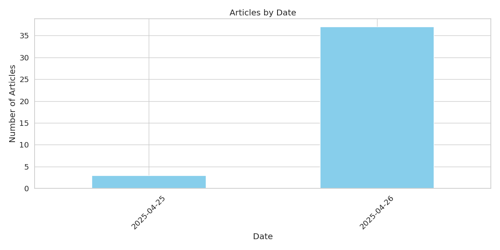
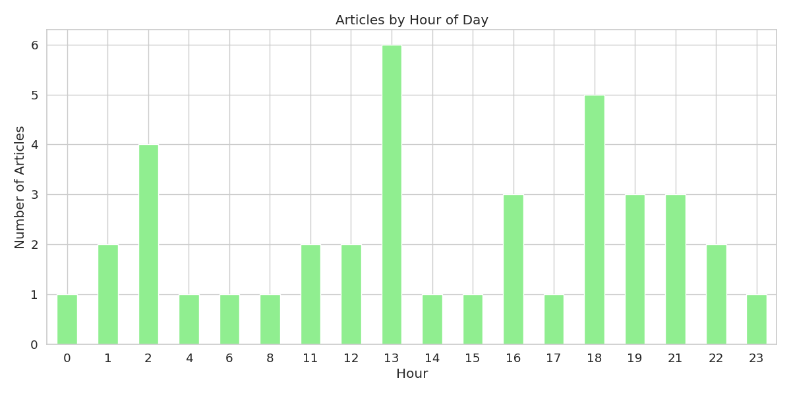
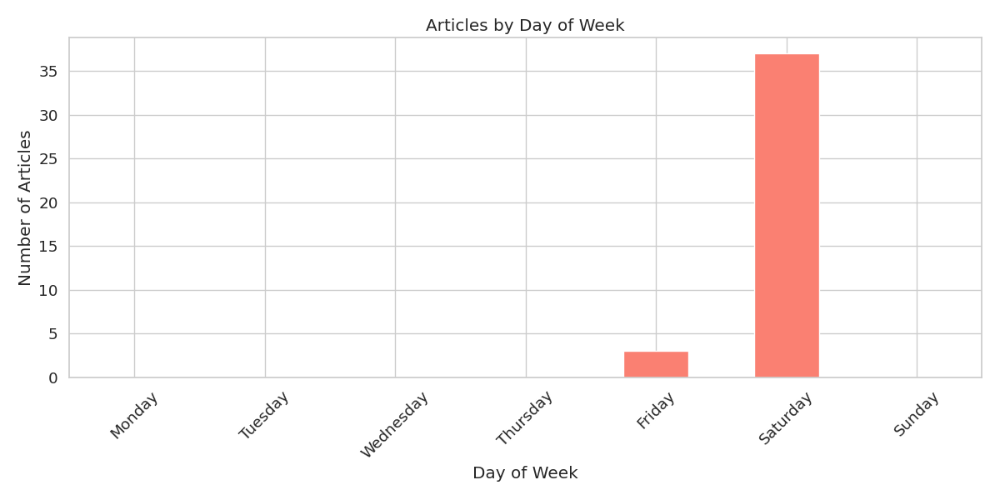
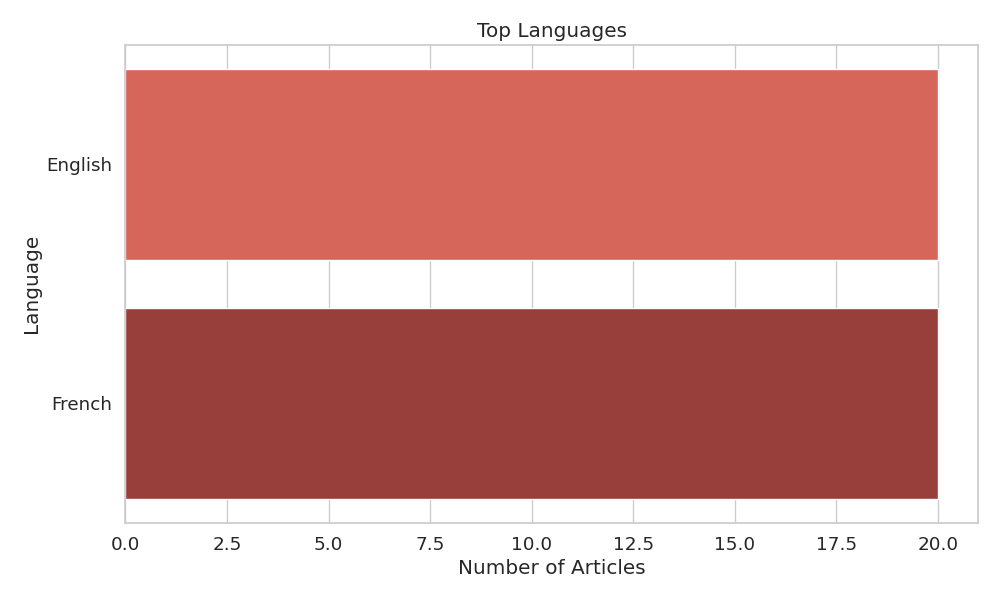
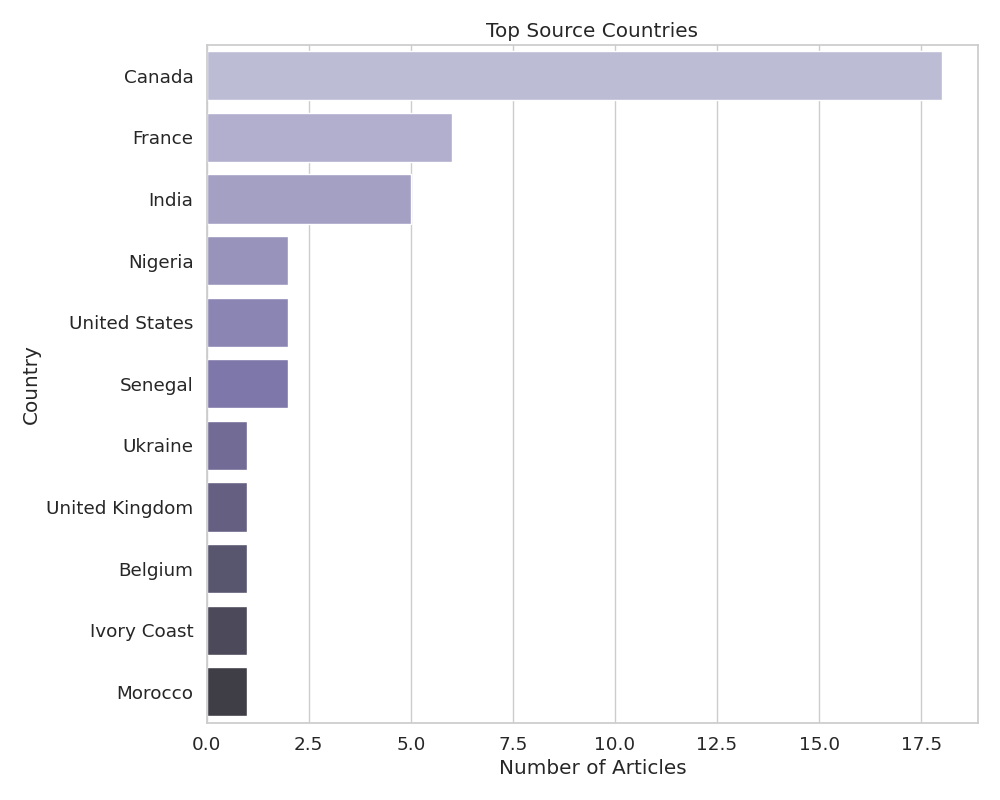
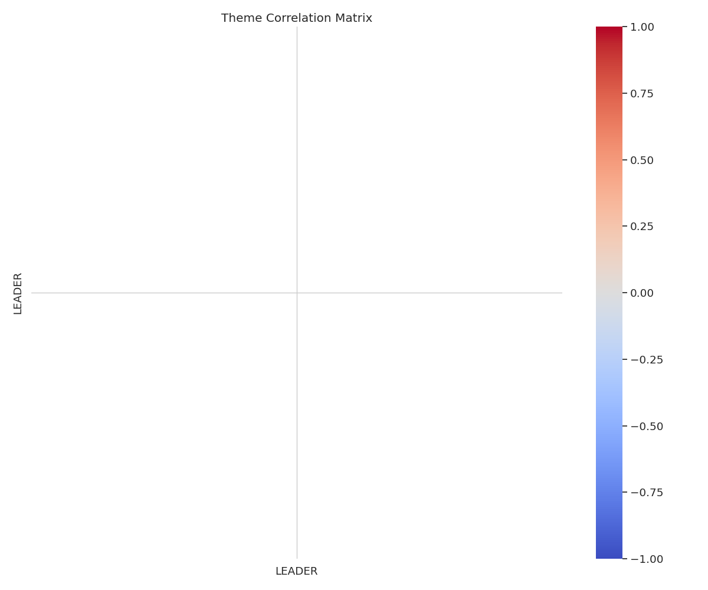

# GDELT News Dataset Analysis (1 month)

## Dataset Summary

- **Total Articles**: 40
- **Total Themes**: 1
- **Date Range**: 20250425T223000Z to 20250426T211500Z (1 month)
- **Languages**: English, French
- **Dataset Size**: 0.00 GB (estimated)
- **Fetch Date**: 2025-04-26 22:26:28

## Theme Distribution

The dataset contains articles from 1 different themes. The top 10 themes are:

| Theme | Description | Count |
|-------|-------------|-------|
| LEADER | References to leadership figures | 40 |

## Temporal Analysis

### Articles by Date

The distribution of articles over the date range:

### Articles by Hour of Day

The distribution of articles by hour of the day:

### Articles by Day of Week

The distribution of articles by day of the week:

## Source Analysis

### Top Domains

The top 10 domains by article count:

| Domain | Count |
|--------|-------|
| lapresse.ca | 4 |
| cbc.ca | 2 |
| economictimes.indiatimes.com | 2 |
| bnnbloomberg.ca | 2 |
| senego.com | 2 |
| theglobeandmail.com | 2 |
| timesofindia.indiatimes.com | 1 |
| torontosun.com | 1 |
| winnipegfreepress.com | 1 |
| cp24.com | 1 |

### Top TLDs

The top 5 top-level domains:

| TLD | Count |
|-----|-------|
| com | 23 |
| ca | 9 |
| fr | 4 |
| ua | 1 |
| uk | 1 |

### Language Distribution

The distribution of articles by language:

### Country Distribution

The distribution of articles by source country:

### Source Diversity

The diversity of news sources in the dataset:

| Metric | Value |
|--------|-------|
| Unique Domains | 32 |
| Unique Countries | 11 |
| Unique Languages | 2 |
| Domain Diversity Index | 0.9612 |
| Country Diversity Index | 0.7488 |
| Language Diversity Index | 0.5000 |

## Theme Relationships

The correlation between the top themes:

## Topic Modeling

### Discovered Topics

The main topics discovered in the article titles:

**Topic 1**: canada, election, la, le, un, chef, de, leader, en, party

**Topic 2**: la, le, un, chef, de, election, leader, en, canada, party

**Topic 3**: la, le, un, chef, de, election, leader, en, canada, party

**Topic 4**: chef, le, en, de, la, un, election, leader, canada, party

**Topic 5**: la, le, un, chef, de, election, leader, en, canada, party

**Topic 6**: leader, party, election, day, la, le, un, chef, de, en

**Topic 7**: de, le, la, un, chef, en, election, leader, canada, party

**Topic 8**: un, canada, le, la, en, chef, de, election, leader, party

**Topic 9**: en, le, de, un, la, chef, election, leader, canada, party

**Topic 10**: la, le, un, chef, de, election, leader, en, canada, party

## Conclusion

This analysis provides an overview of the multilingual news dataset collected from GDELT. This dataset provides a comprehensive view of recent news coverage across multiple themes and sources in multiple languages.

### Benefits of the Multilingual Dataset

1. **Recent Coverage**: Focuses on the most recent and relevant news articles
2. **API Reliability**: Uses the officially supported timeframe for maximum data quality
3. **Source Diversity**: Captures a wide range of news sources and perspectives
4. **Theme Coverage**: Includes articles across numerous thematic categories
5. **Language Diversity**: Provides content in multiple languages for cross-lingual analysis
6. **Cultural Perspectives**: Offers different cultural viewpoints on the same news events
7. **Training Data**: Provides a substantial multilingual dataset for training machine learning models
8. **Current Events**: Reflects the current news landscape and emerging topics across language barriers

