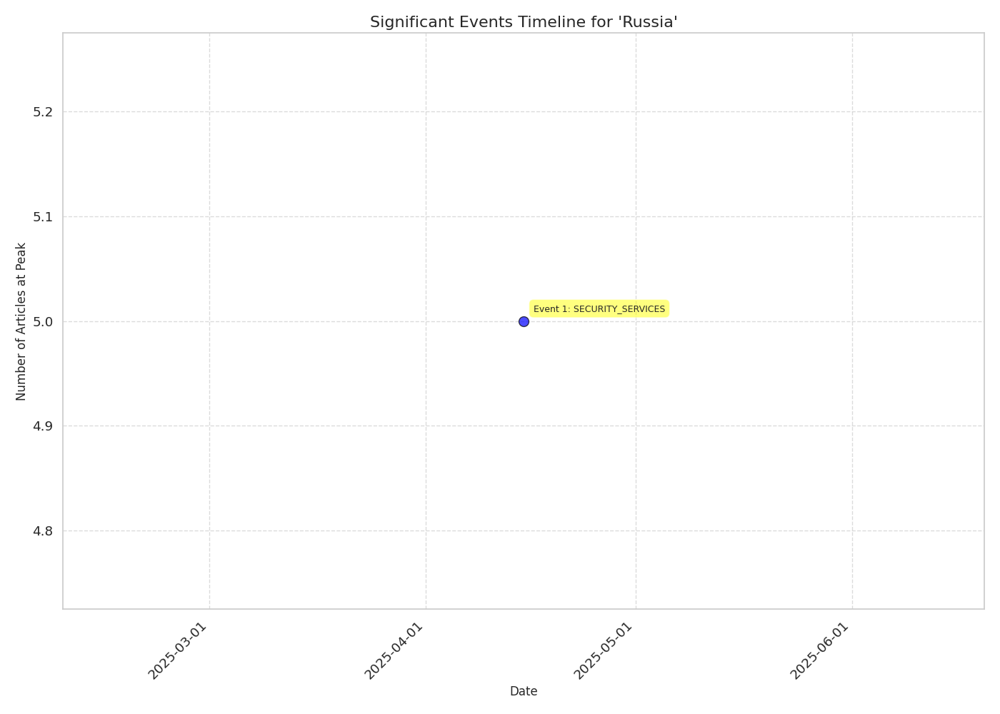

# Event Timeline Report for 'Russia'

## Overview

- **Total Events**: 1

## Event Timeline

## Significant Events

### Event 1: SECURITY_SERVICES

- **Date Range**: 2025-04-12 to 2025-04-18
- **Peak Date**: 2025-04-15
- **Article Count**: 9 (Peak: 5)

#### Top Themes

- SECURITY_SERVICES: 7 articles
- TERROR: 1 articles
- MEDIA_SOCIAL: 1 articles

#### Top Sources

- thestar.com.my: 3 articles
- yahoo.com: 2 articles
- politico.eu: 2 articles
- nypost.com: 1 articles
- news18.com: 1 articles

#### Key Articles

- [Series of blasts shake Russia Kursk near Ukrainian border , Russian Telegram channels report](https://www.thestar.com.my/news/world/2025/04/15/series-of-blasts-shake-russia039s-kursk-near-ukrainian-border-russian-telegram-channels-report) - thestar.com.my (2025-04-15, Trust: 0.75)
- [Russia spy chief says Russia , Belarus ready to act over European  escalation  around Ukraine](https://www.yahoo.com/news/russias-spy-chief-says-russia-090052961.html) - yahoo.com (2025-04-15, Trust: 0.75)
- [Russia spy chief says Russia , Belarus ready to act over European  escalation  around Ukraine](https://www.yahoo.com/news/russias-spy-chief-says-russia-090052961.html) - yahoo.com (2025-04-15, Trust: 0.75)
- [Russia spy chief says Russia , Belarus ready to act over European  escalation  around Ukraine](https://www.thestar.com.my/news/world/2025/04/15/russia039s-spy-chief-says-russia-belarus-ready-to-act-over-european-039escalation039-around-ukraine) - thestar.com.my (2025-04-15, Trust: 0.75)
- [Russia spy chief says Russia , Belarus ready to act over European  escalation  around Ukraine](https://www.thestar.com.my/news/world/2025/04/15/russia039s-spy-chief-says-russia-belarus-ready-to-act-over-european-039escalation039-around-ukraine) - thestar.com.my (2025-04-15, Trust: 0.75)

