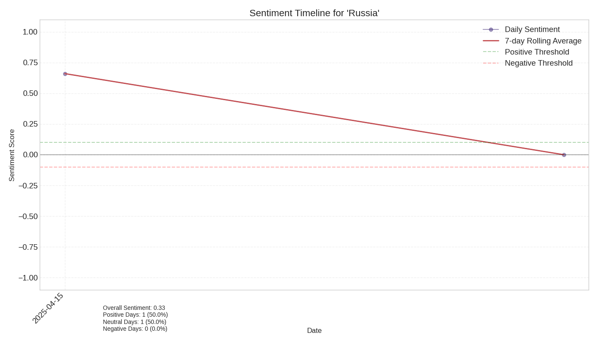

# Sentiment Analysis Report for 'Russia' over Time

## Overview

- **Time Period**: 2025-04-15 to 2025-04-17
- **Total Articles**: 7
- **Overall Sentiment**: 0.47 (on a scale from -1 to 1)

## Sentiment Distribution

- **Positive Articles**: 5 (71.4%)
- **Neutral Articles**: 2 (28.6%)
- **Negative Articles**: 0 (0.0%)

## Sentiment Visualization

## Sentiment by Source

| Source | Sentiment Score |
|--------|----------------|
| nypost.com | 0.00 |
| politico.eu | 0.00 |
| yahoo.com | 0.42 |
| thestar.com.my | 0.82 |

## Articles by Sentiment

### Positive Articles

| Date | Source | Title | Sentiment |
|------|--------|-------|-----------|
No detailed article sentiment data available.

### Negative Articles

| Date | Source | Title | Sentiment |
|------|--------|-------|-----------|
No detailed article sentiment data available.

## Sentiment Timeline

The chart shows how sentiment towards the entity changed during the event period. Positive values indicate positive sentiment, while negative values indicate negative sentiment.

## Interpretation

The overall sentiment towards 'Russia' during this event was very positive (score: 0.47). A large majority (71.4%) of articles expressed positive sentiment. 