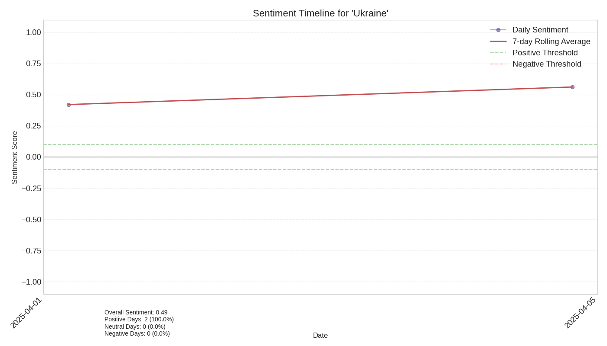

# Sentiment Analysis Report for 'Ukraine' over Time

## Overview

- **Time Period**: 2025-04-02 to 2025-04-05
- **Total Articles**: 3
- **Overall Sentiment**: 0.51 (on a scale from -1 to 1)

## Sentiment Distribution

- **Positive Articles**: 3 (100.0%)
- **Neutral Articles**: 0 (0.0%)
- **Negative Articles**: 0 (0.0%)

## Sentiment Visualization

## Sentiment by Source

| Source | Sentiment Score |
|--------|----------------|
| yahoo.com | 0.42 |
| theguardian.com | 0.70 |

## Articles by Sentiment

### Positive Articles

| Date | Source | Title | Sentiment |
|------|--------|-------|-----------|
No detailed article sentiment data available.

### Negative Articles

| Date | Source | Title | Sentiment |
|------|--------|-------|-----------|
No detailed article sentiment data available.

## Sentiment Timeline

The chart shows how sentiment towards the entity changed during the event period. Positive values indicate positive sentiment, while negative values indicate negative sentiment.

## Interpretation

The overall sentiment towards 'Ukraine' during this event was very positive (score: 0.51). A large majority (100.0%) of articles expressed positive sentiment. 