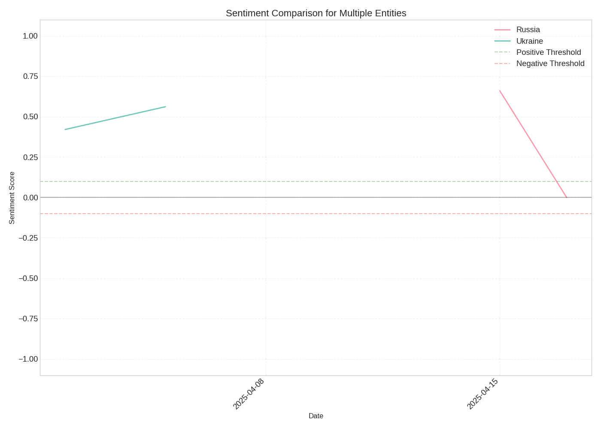
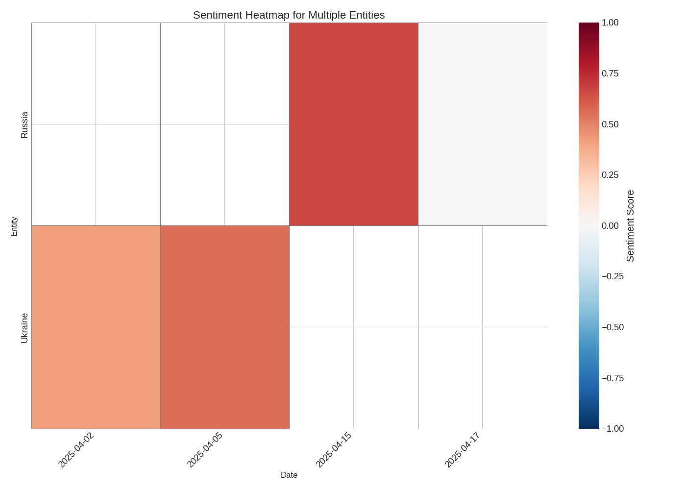
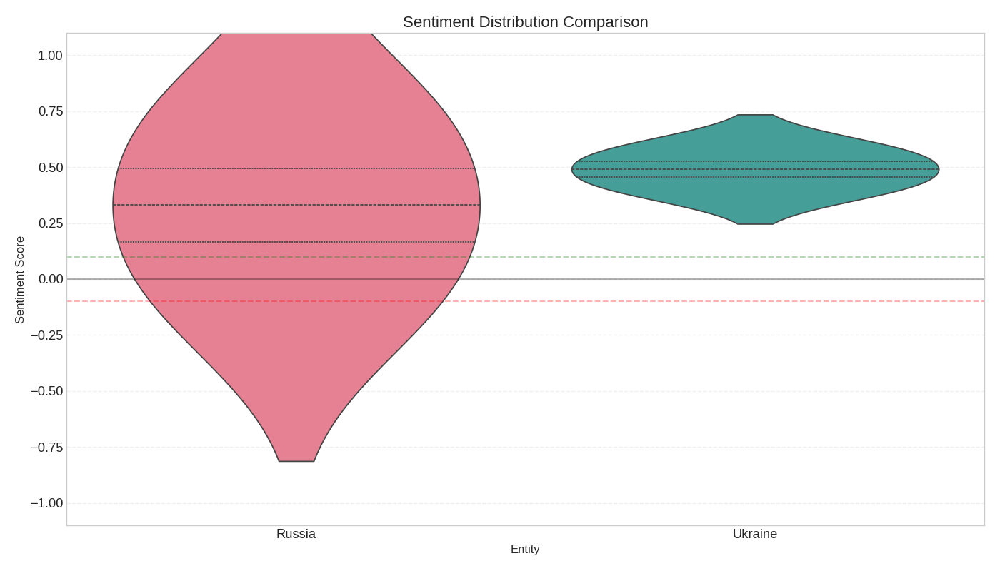

# Sentiment Comparison Report

## Overview

This report compares sentiment towards multiple entities in news articles:
Russia, Ukraine

## Sentiment Timeline Comparison

The following chart shows how sentiment towards each entity changed over time:

## Sentiment Heatmap

The heatmap below shows sentiment towards each entity over time, with red indicating negative sentiment and blue indicating positive sentiment:

## Sentiment Distribution

The following chart shows the distribution of sentiment for each entity:

## Entity Sentiment Summary

### Russia

- **Overall Sentiment**: 0.47
- **Positive Days**: 5 (71.4%)
- **Neutral Days**: 2 (28.6%)
- **Negative Days**: 0 (0.0%)

### Ukraine

- **Overall Sentiment**: 0.51
- **Positive Days**: 3 (100.0%)
- **Neutral Days**: 0 (0.0%)
- **Negative Days**: 0 (0.0%)

## Comparative Analysis

- **Most Positive Coverage**: Ukraine (Score: 0.51)
- **Most Negative Coverage**: Russia (Score: 0.47)

### Interpretation

The sentiment towards all entities is relatively similar, without strong positive or negative bias.
