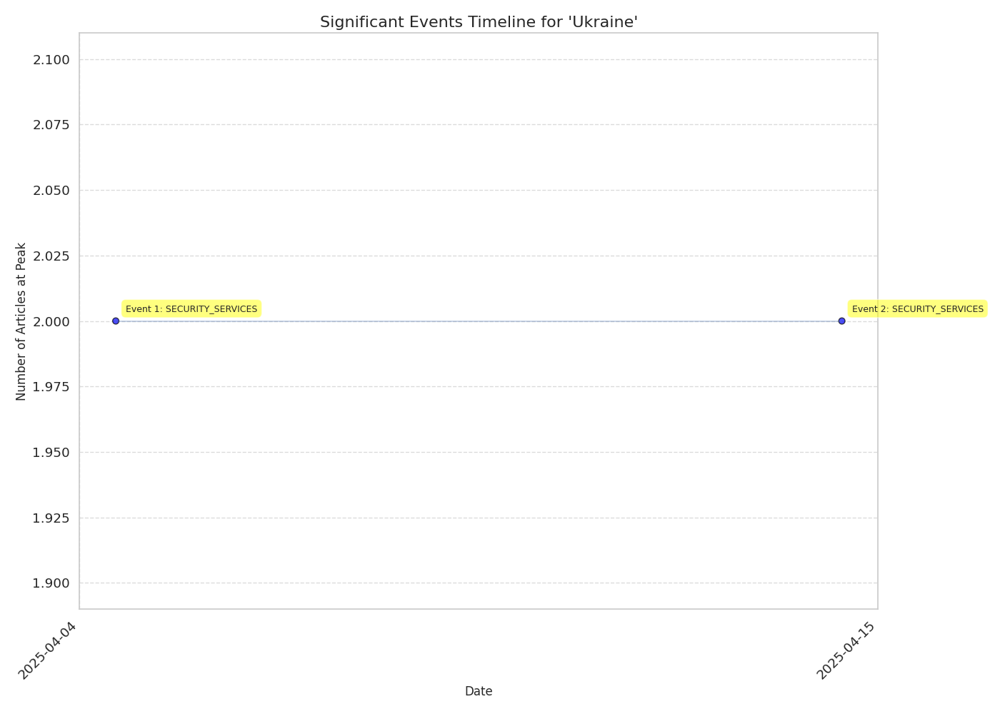

# Event Timeline Report for 'Ukraine'

## Overview

- **Total Events**: 2

## Event Timeline

## Significant Events

### Event 1: SECURITY_SERVICES

- **Date Range**: 2025-04-02 to 2025-04-08
- **Peak Date**: 2025-04-05
- **Article Count**: 3 (Peak: 2)

#### Top Themes

- SECURITY_SERVICES: 3 articles

#### Top Sources

- yahoo.com: 2 articles
- theguardian.com: 1 articles

#### Key Articles

- [More than fifth of Russian intelligence recruits in Ukraine are minors , SBU says](https://www.yahoo.com/news/more-fifth-russian-intelligences-recruits-092736868.html) - yahoo.com (2025-04-02, Trust: 0.75)
- [US neo - Nazi group with Russia - based leader calls for targeted Ukraine attacks](https://www.theguardian.com/us-news/2025/apr/05/the-base-neo-nazi-russia-ukraine) - theguardian.com (2025-04-05, Trust: 0.75)
- [Ukraine investigating leaked U . S . minerals deal , FT reports](https://www.yahoo.com/news/ukraine-investigating-leaked-u-minerals-144004738.html) - yahoo.com (2025-04-05, Trust: 0.75)

### Event 2: SECURITY_SERVICES

- **Date Range**: 2025-04-12 to 2025-04-18
- **Peak Date**: 2025-04-15
- **Article Count**: 3 (Peak: 2)

#### Top Themes

- SECURITY_SERVICES: 2 articles
- MILITARY: 1 articles

#### Top Sources

- yahoo.com: 1 articles
- thestar.com.my: 1 articles
- defensenews.com: 1 articles

#### Key Articles

- [Russia spy chief says Russia , Belarus ready to act over European  escalation  around Ukraine](https://www.yahoo.com/news/russias-spy-chief-says-russia-090052961.html) - yahoo.com (2025-04-15, Trust: 0.75)
- [Russia spy chief says Russia , Belarus ready to act over European  escalation  around Ukraine](https://www.thestar.com.my/news/world/2025/04/15/russia039s-spy-chief-says-russia-belarus-ready-to-act-over-european-039escalation039-around-ukraine) - thestar.com.my (2025-04-15, Trust: 0.75)
- [Turkey hosts Black Sea security talks with Ukraine , France , united kingdom ](https://www.defensenews.com/global/europe/2025/04/16/turkey-hosts-black-sea-security-talks-with-ukraine-france-uk/) - defensenews.com (2025-04-16, Trust: 0.75)

