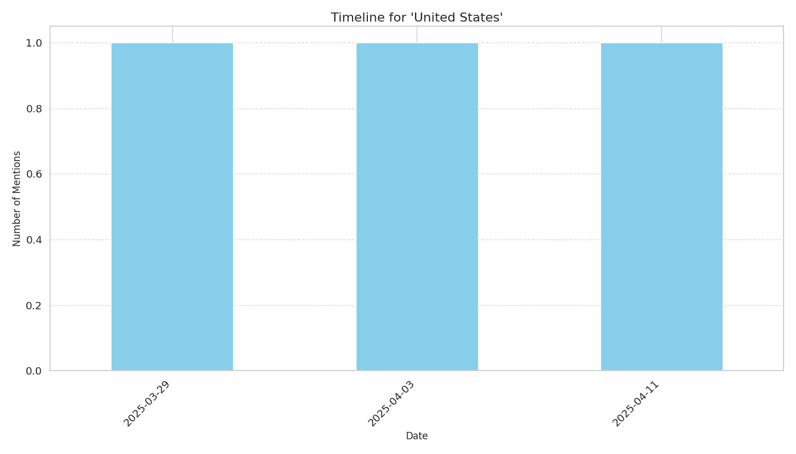

# Timeline Report for 'United States'

## Overview

- **Total Mentions**: 3
- **Date Range**: 2025-03-29 to 2025-04-11

## Mention Frequency

## Top Sources

| Source | Mentions |
|--------|----------|
| globalsecurity.org | 1 |
| stiripesurse.ro | 1 |
| naturalnews.com | 1 |

## Top Themes

| Theme | Mentions |
|-------|----------|
| MARITIME | 1 |
| EDUCATION | 1 |
| MILITARY | 1 |

## Top Articles

| Date | Source | Title | Trust Score |
|------|--------|-------|-------------|
| 2025-04-03 | stiripesurse.ro | [Education Minister David , discussions on research - innovation , transatlantic relations , competitiveness , on visit to the United States](https://www.stiripesurse.ro/education-minister-david-discussions-on-research-innovation-transatlantic-relations-competitiveness-on-visit-to-the-united-states_3636083.html) | 0.80 |
| 2025-03-29 | globalsecurity.org | [Japan , Philippines and United States Conduct Multilateral Maritime Cooperative Activity](https://www.globalsecurity.org/military/library/news/2025/03/mil-250328-usn02.htm) | 0.75 |
| 2025-04-11 | naturalnews.com | [  Losing Military Supremacy  by Andrei Martyanov : A wake - up call for the United States – NaturalNews . com](https://www.naturalnews.com/2025-04-11-losing-military-supremacy-by-andrei-martyanov.html) | 0.75 |
