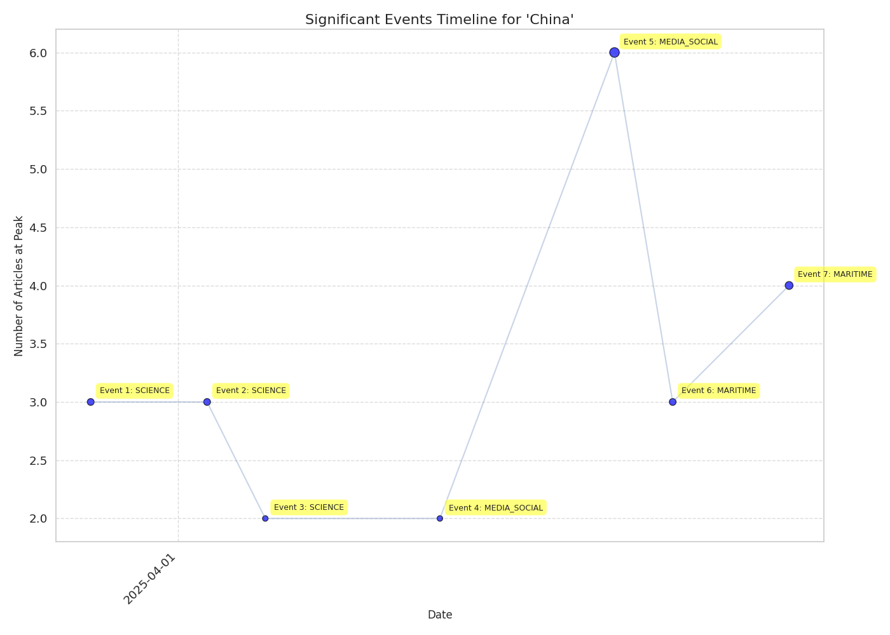

# Event Timeline Report for 'China'

## Overview

- **Total Events**: 7

## Event Timeline

## Significant Events

### Event 1: SCIENCE

- **Date Range**: 2025-03-26 to 2025-04-01
- **Peak Date**: 2025-03-29
- **Article Count**: 8 (Peak: 3)

#### Top Themes

- SCIENCE: 5 articles
- MARITIME: 1 articles
- NATURAL_DISASTER: 1 articles

#### Top Sources

- china.org.cn: 4 articles
- thediplomat.com: 1 articles
- 9news.com.au: 1 articles
- news24online.com: 1 articles
- theplosblog.plos.org: 1 articles

#### Key Articles

- [China releases top 10 scientific advances of 2024 - China . org . cn](http://www.china.org.cn/china/2025-03/28/content_117792218.htm) - china.org.cn (2025-03-28, Trust: 0.85)
- [China releases top 10 scientific advances of 2024 - China . org . cn](http://www.china.org.cn/china/2025-03/28/content_117792218.htm) - china.org.cn (2025-03-28, Trust: 0.85)
- [China sci - fi industry total revenue hits 108 . 96B yuan in 2024](http://www.china.org.cn/arts/2025-03/29/content_117794344.htm) - china.org.cn (2025-03-29, Trust: 0.85)
- [China Science Fiction Convention 2025 opens in Beijing with futuristic spectacle](http://www.china.org.cn/arts/2025-03/29/content_117794783.htm) - china.org.cn (2025-03-29, Trust: 0.85)
- [PLOS announces new partnership in China - The Official PLOS Blog](https://theplosblog.plos.org/2025/04/plos-announces-new-partnership-in-china/) - theplosblog.plos.org (2025-04-01, Trust: 0.85)

### Event 2: SCIENCE

- **Date Range**: 2025-03-30 to 2025-04-05
- **Peak Date**: 2025-04-02
- **Article Count**: 10 (Peak: 3)

#### Top Themes

- SCIENCE: 4 articles
- MARITIME: 2 articles
- TERROR: 1 articles

#### Top Sources

- 9news.com.au: 1 articles
- news24online.com: 1 articles
- theplosblog.plos.org: 1 articles
- portal.sina.com.hk: 1 articles
- manilatimes.net: 1 articles

#### Key Articles

- [China Science Fiction Convention Concludes with Insightful  Sci - Fi+  Forums Exploring Future Frontiers](https://portal.sina.com.hk/finance/finance-prnewswire/prnasia/2025/04/02/1153543/china-science-fiction-convention-concludes-with-insightful-sci-fi-forums-exploring-future-frontiers/) - portal.sina.com.hk (2025-04-02, Trust: 0.85)
- [PLOS announces new partnership in China - The Official PLOS Blog](https://theplosblog.plos.org/2025/04/plos-announces-new-partnership-in-china/) - theplosblog.plos.org (2025-04-01, Trust: 0.85)
- [China Science Fiction Convention Concludes with Insightful  Sci - Fi+  Forums Exploring Future Frontiers](https://www.manilatimes.net/2025/04/02/tmt-newswire/pr-newswire/china-science-fiction-convention-concludes-with-insightful-sci-fi-forums-exploring-future-frontiers/2084827) - manilatimes.net (2025-04-02, Trust: 0.85)
- [China museum to screen international science movies](http://www.china.org.cn/arts/2025-04/02/content_117801241.htm) - china.org.cn (2025-04-02, Trust: 0.85)
- [Madhya Pradesh HC Issues Notice On Student Plea Who Completed MBBS From China , Against Increase Of Internship Period To Three Years](https://www.livelaw.in/high-court/madhya-pradesh-high-court/madhya-pradesh-high-court-hearing-plea-against-mbbs-students-internship-period-extension-288531) - livelaw.in (2025-04-05, Trust: 0.80)

### Event 3: SCIENCE

- **Date Range**: 2025-04-01 to 2025-04-07
- **Peak Date**: 2025-04-04
- **Article Count**: 9 (Peak: 2)

#### Top Themes

- SCIENCE: 4 articles
- MARITIME: 2 articles
- TERROR: 1 articles

#### Top Sources

- news24online.com: 1 articles
- theplosblog.plos.org: 1 articles
- portal.sina.com.hk: 1 articles
- manilatimes.net: 1 articles
- china.org.cn: 1 articles

#### Key Articles

- [PLOS announces new partnership in China - The Official PLOS Blog](https://theplosblog.plos.org/2025/04/plos-announces-new-partnership-in-china/) - theplosblog.plos.org (2025-04-01, Trust: 0.85)
- [China Science Fiction Convention Concludes with Insightful  Sci - Fi+  Forums Exploring Future Frontiers](https://www.manilatimes.net/2025/04/02/tmt-newswire/pr-newswire/china-science-fiction-convention-concludes-with-insightful-sci-fi-forums-exploring-future-frontiers/2084827) - manilatimes.net (2025-04-02, Trust: 0.85)
- [China Science Fiction Convention Concludes with Insightful  Sci - Fi+  Forums Exploring Future Frontiers](https://portal.sina.com.hk/finance/finance-prnewswire/prnasia/2025/04/02/1153543/china-science-fiction-convention-concludes-with-insightful-sci-fi-forums-exploring-future-frontiers/) - portal.sina.com.hk (2025-04-02, Trust: 0.85)
- [China museum to screen international science movies](http://www.china.org.cn/arts/2025-04/02/content_117801241.htm) - china.org.cn (2025-04-02, Trust: 0.85)
- [Madhya Pradesh HC Issues Notice On Student Plea Who Completed MBBS From China , Against Increase Of Internship Period To Three Years](https://www.livelaw.in/high-court/madhya-pradesh-high-court/madhya-pradesh-high-court-hearing-plea-against-mbbs-students-internship-period-extension-288531) - livelaw.in (2025-04-05, Trust: 0.80)

### Event 4: MEDIA_SOCIAL

- **Date Range**: 2025-04-07 to 2025-04-13
- **Peak Date**: 2025-04-10
- **Article Count**: 11 (Peak: 2)

#### Top Themes

- MEDIA_SOCIAL: 4 articles
- MEDICAL: 2 articles
- MILITARY: 2 articles

#### Top Sources

- yahoo.com: 2 articles
- china.org.cn: 1 articles
- tribune.com.pk: 1 articles
- moneycontrol.com: 1 articles
- economictimes.indiatimes.com: 1 articles

#### Key Articles

- [Tip - off service launched to combat medical insurance fraud - China . org . cn](http://www.china.org.cn/china/2025-04/08/content_117810774.htm) - china.org.cn (2025-04-08, Trust: 0.80)
- [Indian medical device makers prepare for US push , sensing opportunity from China tariffs](https://www.moneycontrol.com/news/business/companies/indian-medical-device-makers-prepare-for-us-push-sensing-opportunity-from-china-tariffs-12991910.html) - moneycontrol.com (2025-04-11, Trust: 0.80)
- [Zelensky claims China - linked soldiers captured in Donetsk battle](https://tribune.com.pk/story/2538808/zelensky-claims-china-linked-soldiers-captured-in-donetsk-battle) - tribune.com.pk (2025-04-09, Trust: 0.75)
- [Trump sics DOGE on the Navy but ignores China port fees](https://www.yahoo.com/news/trump-sics-doge-navy-ignores-151023507.html) - yahoo.com (2025-04-10, Trust: 0.75)
- [UK sends military chief to China for first visit in 10 years](https://www.yahoo.com/news/uk-sends-military-chief-china-184335305.html) - yahoo.com (2025-04-10, Trust: 0.75)

### Event 5: MEDIA_SOCIAL

- **Date Range**: 2025-04-13 to 2025-04-19
- **Peak Date**: 2025-04-16
- **Article Count**: 15 (Peak: 6)

#### Top Themes

- MEDIA_SOCIAL: 4 articles
- MARITIME: 4 articles
- SECURITY_SERVICES: 3 articles

#### Top Sources

- politico.eu: 2 articles
- cnbc.com: 1 articles
- nbcmiami.com: 1 articles
- nbcphiladelphia.com: 1 articles
- dawn.com: 1 articles

#### Key Articles

- [Trump decimation of US science and workforce funding is a gift to China](https://thehill.com/opinion/white-house/5250224-trump-attacks-american-science/) - thehill.com (2025-04-16, Trust: 0.85)
- [China urges Trump to correct mistakes and heed  rational voice on reciprocal tariffs – NBC Los Angeles](https://www.nbclosangeles.com/news/business/money-report/china-urges-trump-to-correct-mistakes-and-heed-rational-voices-on-reciprocal-tariffs/3677738/) - nbclosangeles.com (2025-04-13, Trust: 0.75)
- [China urges Trump to heed  rational voice on reciprocal tariffs](https://www.cnbc.com/2025/04/13/china-urges-trump-to-heed-rational-voices-on-reciprocal-tariffs.html) - cnbc.com (2025-04-13, Trust: 0.75)
- [China urges Trump to correct mistakes and heed  rational voice on reciprocal tariffs – NBC10 Philadelphia](https://www.nbcphiladelphia.com/news/business/money-report/china-urges-trump-to-correct-mistakes-and-heed-rational-voices-on-reciprocal-tariffs/4159416/) - nbcphiladelphia.com (2025-04-13, Trust: 0.75)
- [China keen on Port Qasim desalination project - Newspaper](https://www.dawn.com/news/1904542/china-keen-on-port-qasim-desalination-project) - dawn.com (2025-04-16, Trust: 0.75)

### Event 6: MARITIME

- **Date Range**: 2025-04-15 to 2025-04-21
- **Peak Date**: 2025-04-18
- **Article Count**: 14 (Peak: 3)

#### Top Themes

- MARITIME: 6 articles
- SECURITY_SERVICES: 3 articles
- AFFECT: 2 articles

#### Top Sources

- globalsecurity.org: 2 articles
- politico.eu: 2 articles
- radio.gov.pk: 1 articles
- dawn.com: 1 articles
- brecorder.com: 1 articles

#### Key Articles

- [Trump decimation of US science and workforce funding is a gift to China](https://thehill.com/opinion/white-house/5250224-trump-attacks-american-science/) - thehill.com (2025-04-16, Trust: 0.85)
- [China keen on Port Qasim desalination project - Newspaper](https://www.dawn.com/news/1904542/china-keen-on-port-qasim-desalination-project) - dawn.com (2025-04-16, Trust: 0.75)
- [Pakistan , China vow to deepen bilateral ties in maritime domain](https://www.radio.gov.pk/16-04-2025/pakistan-china-vow-to-deepen-bilateral-ties-in-maritime-domain) - radio.gov.pk (2025-04-16, Trust: 0.75)
- [Pakistan , China agree to strengthen coordination , cooperation on maritime policies - Pakistan](https://www.brecorder.com/news/40357936/pakistan-china-agree-to-strengthen-coordination-cooperation-on-maritime-policies) - brecorder.com (2025-04-16, Trust: 0.75)
- [China , Vietnam agree to manage and resolve maritime issues](https://www.globalsecurity.org/military/library/news/2025/04/mil-250415-prc-mnd01.htm) - globalsecurity.org (2025-04-16, Trust: 0.75)

### Event 7: MARITIME

- **Date Range**: 2025-04-19 to 2025-04-25
- **Peak Date**: 2025-04-22
- **Article Count**: 17 (Peak: 4)

#### Top Themes

- MARITIME: 6 articles
- MILITARY: 6 articles
- SECURITY_SERVICES: 2 articles

#### Top Sources

- globalsecurity.org: 2 articles
- yahoo.com: 2 articles
- koreaherald.com: 2 articles
- manilatimes.net: 1 articles
- asia.nikkei.com: 1 articles

#### Key Articles

- [China denies allegations of supplying weapons to Russia amid Ukraine conflict](https://www.khaama.com/china-denies-allegations-of-supplying-weapons-to-russia-amid-ukraine-conflict/) - khaama.com (2025-04-19, Trust: 0.75)
- [Multiple Chinese industry associations oppose US restrictions on China maritime , logistics , shipbuilding sectors](https://www.globalsecurity.org/wmd/library/news/china/2025/04/china-250419-globaltimes02.htm) - globalsecurity.org (2025-04-20, Trust: 0.75)
- [LOréal plans major layoffs in China amid sales slump](https://asia.nikkei.com/Spotlight/Caixin/L-Oreal-plans-major-layoffs-in-China-amid-sales-slump) - asia.nikkei.com (2025-04-21, Trust: 0.75)
- [China says it  warned off  PH navy frigate in Scarborough Shoal](https://www.manilatimes.net/2025/04/22/news/national/china-says-it-warned-off-ph-navy-frigate-in-scarborough-shoal/2095906) - manilatimes.net (2025-04-21, Trust: 0.75)
- [Myanmar Rebels Prepare To Hand Key City Back To Junta , China Says](https://www.ibtimes.com/myanmar-rebels-prepare-hand-key-city-back-junta-china-says-3770904) - ibtimes.com (2025-04-22, Trust: 0.75)

