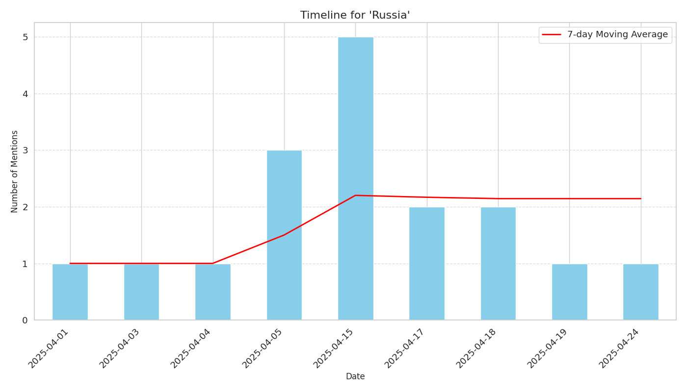

# Timeline Report for 'Russia'

## Overview

- **Total Mentions**: 17
- **Date Range**: 2025-04-01 to 2025-04-24

## Mention Frequency

## Top Sources

| Source | Mentions |
|--------|----------|
| yahoo.com | 4 |
| thestar.com.my | 3 |
| khaama.com | 2 |
| politico.eu | 2 |
| ksl.com | 1 |
| aninews.in | 1 |
| naturalnews.com | 1 |
| theguardian.com | 1 |
| nypost.com | 1 |
| news18.com | 1 |

## Top Themes

| Theme | Mentions |
|-------|----------|
| SECURITY_SERVICES | 11 |
| LEGISLATION | 2 |
| TERROR | 2 |
| MARITIME | 1 |
| MEDIA_SOCIAL | 1 |

## Top Articles

| Date | Source | Title | Trust Score |
|------|--------|-------|-------------|
| 2025-04-03 | yahoo.com | [Sen . John Curtis joins bipartisan group in attempt to introduce sanctions against Russia](https://www.yahoo.com/news/sen-john-curtis-joins-bipartisan-182702967.html) | 0.80 |
| 2025-04-04 | ksl.com | [Sen . John Curtis joins bipartisan group in attempt to introduce sanctions against Russia](https://www.ksl.com:443/article/51288634/sen-john-curtis-joins-bipartisan-group-in-attempt-to-introduce-sanctions-against-russia-) | 0.80 |
| 2025-04-01 | yahoo.com | [Poland charges Ukrainian man with scouting Polish military facilities on behalf of Russia](https://www.yahoo.com/news/poland-charges-ukrainian-man-scouting-135855557.html) | 0.75 |
| 2025-04-05 | aninews.in | [India - Russia conclude 14th edition of Naval Exercise Indra 2025](https://aninews.in/news/world/asia/india-russia-conclude-14th-edition-of-naval-exercise-indra-202520250404232100/) | 0.75 |
| 2025-04-05 | theguardian.com | [US neo - Nazi group with Russia - based leader calls for targeted Ukraine attacks](https://www.theguardian.com/us-news/2025/apr/05/the-base-neo-nazi-russia-ukraine) | 0.75 |
| 2025-04-05 | naturalnews.com | [FSB foils Ukrainian terror plot targeting Russian military cadets , exposes Kiev covert war against Russia – NaturalNews . com](https://www.naturalnews.com/2025-04-05-fsb-foils-ukrainian-terror-plot-russian-cadets.html) | 0.75 |
| 2025-04-15 | thestar.com.my | [Series of blasts shake Russia Kursk near Ukrainian border , Russian Telegram channels report](https://www.thestar.com.my/news/world/2025/04/15/series-of-blasts-shake-russia039s-kursk-near-ukrainian-border-russian-telegram-channels-report) | 0.75 |
| 2025-04-15 | yahoo.com | [Russia spy chief says Russia , Belarus ready to act over European  escalation  around Ukraine](https://www.yahoo.com/news/russias-spy-chief-says-russia-090052961.html) | 0.75 |
| 2025-04-15 | yahoo.com | [Russia spy chief says Russia , Belarus ready to act over European  escalation  around Ukraine](https://www.yahoo.com/news/russias-spy-chief-says-russia-090052961.html) | 0.75 |
| 2025-04-15 | thestar.com.my | [Russia spy chief says Russia , Belarus ready to act over European  escalation  around Ukraine](https://www.thestar.com.my/news/world/2025/04/15/russia039s-spy-chief-says-russia-belarus-ready-to-act-over-european-039escalation039-around-ukraine) | 0.75 |
| 2025-04-15 | thestar.com.my | [Russia spy chief says Russia , Belarus ready to act over European  escalation  around Ukraine](https://www.thestar.com.my/news/world/2025/04/15/russia039s-spy-chief-says-russia-belarus-ready-to-act-over-european-039escalation039-around-ukraine) | 0.75 |
| 2025-04-17 | politico.eu | [China is supplying weapons to Russia , Zelenskyy says](https://www.politico.eu/article/china-is-supplying-weapons-to-russia-zelenskyy-said/) | 0.75 |
| 2025-04-17 | nypost.com | [Russia removes Taliban from terror list as ties deepen](https://nypost.com/2025/04/17/world-news/russia-removes-taliban-from-terror-list-as-ties-deepen/) | 0.75 |
| 2025-04-18 | news18.com | [News 18 Evening Digest : US Ready To Walk Away From Russia - Ukraine Peace Deal , India Draws Line Amid Bangladesh Provocations & Other Top Stories](https://www.news18.com/world/news-18-evening-digest-us-ready-to-walk-away-from-russia-ukraine-peace-deal-india-draws-line-amid-bangladeshs-provocations-other-top-stories-ws-bkl-9304445.html) | 0.75 |
| 2025-04-18 | politico.eu | [China denies Zelenskyy charge that it provides Russia with weapons – POLITICO](https://www.politico.eu/article/china-deny-volodymyr-zelenskyy-claim-provide-weapon-russia-lin-jian/) | 0.75 |
| 2025-04-19 | khaama.com | [China denies allegations of supplying weapons to Russia amid Ukraine conflict](https://www.khaama.com/china-denies-allegations-of-supplying-weapons-to-russia-amid-ukraine-conflict/) | 0.75 |
| 2025-04-24 | khaama.com | [Russia and Kazakhstan discuss terrorism threats from Afghanistan](https://www.khaama.com/russia-and-kazakhstan-discuss-terrorism-threats-from-afghanistan/) | 0.75 |
