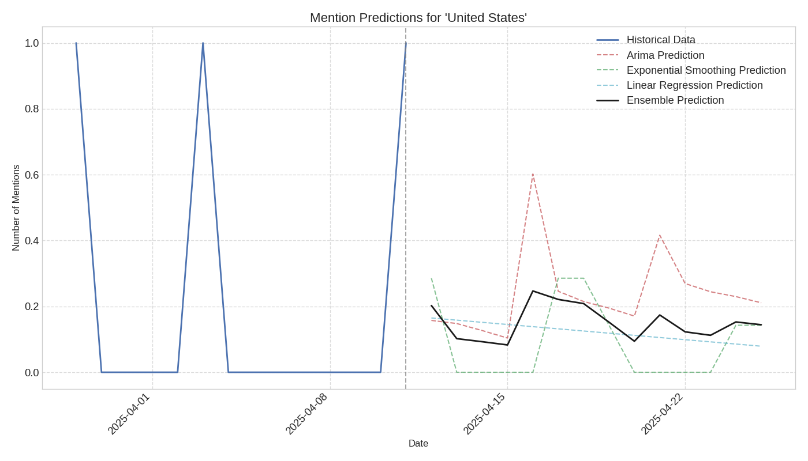

# Prediction Report for 'United States'

## Overview

This report provides predictions for future mentions of 'United States' in news articles.

- **Historical Data Range**: 2025-03-29 to 2025-04-11
- **Prediction Range**: 2025-04-12 to 2025-04-25

## Prediction Visualization

## Prediction Models

The predictions are generated using multiple models:

1. **ARIMA**: A time series forecasting model that accounts for autocorrelation in the data
2. **Exponential Smoothing**: A forecasting method that gives more weight to recent observations
3. **Linear Regression**: A simple trend-based prediction model
4. **Ensemble**: An average of all model predictions

## Predicted Mention Counts

| Date | ARIMA | Exponential Smoothing | Linear Regression | Ensemble |
|------|-------|------------------------|-------------------|----------|
| 2025-04-12 | 0.16 | 0.29 | 0.16 | 0.20 |
| 2025-04-13 | 0.15 | 0.00 | 0.16 | 0.10 |
| 2025-04-14 | 0.13 | 0.00 | 0.15 | 0.09 |
| 2025-04-15 | 0.10 | 0.00 | 0.15 | 0.08 |
| 2025-04-16 | 0.60 | 0.00 | 0.14 | 0.25 |
| 2025-04-17 | 0.25 | 0.29 | 0.13 | 0.22 |
| 2025-04-18 | 0.21 | 0.29 | 0.13 | 0.21 |
| 2025-04-19 | 0.19 | 0.14 | 0.12 | 0.15 |
| 2025-04-20 | 0.17 | 0.00 | 0.11 | 0.09 |
| 2025-04-21 | 0.42 | 0.00 | 0.11 | 0.17 |
| 2025-04-22 | 0.27 | 0.00 | 0.10 | 0.12 |
| 2025-04-23 | 0.24 | 0.00 | 0.09 | 0.11 |
| 2025-04-24 | 0.23 | 0.14 | 0.09 | 0.15 |
| 2025-04-25 | 0.21 | 0.14 | 0.08 | 0.14 |

## Interpretation

The prediction chart shows the historical mention pattern and the forecasted mentions for the entity.
The ensemble prediction (black line) represents the consensus forecast from all models.

### Key Observations:

- **Decreasing Trend**: The model predicts a decrease in mentions of 'United States' in the near future.

### Note on Reliability:

These predictions are based on historical patterns and should be interpreted with caution.
Unexpected events or changes in news coverage can significantly affect actual outcomes.
