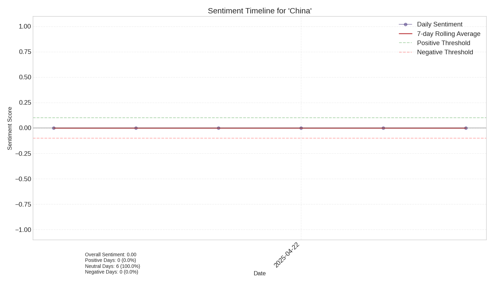

# Sentiment Analysis Report for 'China' over Time

## Overview

- **Time Period**: 2025-04-19 to 2025-04-24
- **Total Articles**: 14
- **Overall Sentiment**: 0.00 (on a scale from -1 to 1)

## Sentiment Distribution

- **Positive Articles**: 0 (0.0%)
- **Neutral Articles**: 14 (100.0%)
- **Negative Articles**: 0 (0.0%)

## Sentiment Visualization

## Sentiment by Source

| Source | Sentiment Score |
|--------|----------------|
| americanmilitarynews.com | 0.00 |
| asia.nikkei.com | 0.00 |
| digitaljournal.com | 0.00 |
| globalsecurity.org | 0.00 |
| ibtimes.com | 0.00 |
| khaama.com | 0.00 |
| koreaherald.com | 0.00 |
| manilatimes.net | 0.00 |
| thehindu.com | 0.00 |
| timesofindia.indiatimes.com | 0.00 |

## Articles by Sentiment

### Positive Articles

| Date | Source | Title | Sentiment |
|------|--------|-------|-----------|
No detailed article sentiment data available.

### Negative Articles

| Date | Source | Title | Sentiment |
|------|--------|-------|-----------|
No detailed article sentiment data available.

## Sentiment Timeline

The chart shows how sentiment towards the entity changed during the event period. Positive values indicate positive sentiment, while negative values indicate negative sentiment.

## Interpretation

The overall sentiment towards 'China' during this event was neutral (score: 0.00). Articles were evenly split between positive and negative sentiment. 