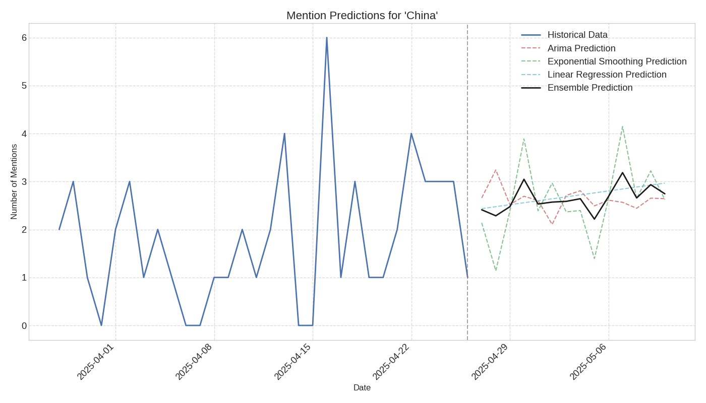

# Prediction Report for 'China'

## Overview

This report provides predictions for future mentions of 'China' in news articles.

- **Historical Data Range**: 2025-03-28 to 2025-04-26
- **Prediction Range**: 2025-04-27 to 2025-05-10

## Prediction Visualization

## Prediction Models

The predictions are generated using multiple models:

1. **ARIMA**: A time series forecasting model that accounts for autocorrelation in the data
2. **Exponential Smoothing**: A forecasting method that gives more weight to recent observations
3. **Linear Regression**: A simple trend-based prediction model
4. **Ensemble**: An average of all model predictions

## Predicted Mention Counts

| Date | ARIMA | Exponential Smoothing | Linear Regression | Ensemble |
|------|-------|------------------------|-------------------|----------|
| 2025-04-27 | 2.66 | 2.14 | 2.43 | 2.41 |
| 2025-04-28 | 3.24 | 1.14 | 2.48 | 2.29 |
| 2025-04-29 | 2.52 | 2.39 | 2.52 | 2.47 |
| 2025-04-30 | 2.69 | 3.89 | 2.56 | 3.05 |
| 2025-05-01 | 2.60 | 2.39 | 2.60 | 2.53 |
| 2025-05-02 | 2.11 | 2.97 | 2.64 | 2.57 |
| 2025-05-03 | 2.71 | 2.37 | 2.68 | 2.59 |
| 2025-05-04 | 2.81 | 2.39 | 2.72 | 2.64 |
| 2025-05-05 | 2.49 | 1.39 | 2.76 | 2.22 |
| 2025-05-06 | 2.61 | 2.64 | 2.80 | 2.69 |
| 2025-05-07 | 2.57 | 4.14 | 2.84 | 3.18 |
| 2025-05-08 | 2.44 | 2.64 | 2.88 | 2.66 |
| 2025-05-09 | 2.65 | 3.22 | 2.93 | 2.93 |
| 2025-05-10 | 2.64 | 2.62 | 2.97 | 2.74 |

## Interpretation

The prediction chart shows the historical mention pattern and the forecasted mentions for the entity.
The ensemble prediction (black line) represents the consensus forecast from all models.

### Key Observations:

- **Increasing Trend**: The model predicts an increase in mentions of 'China' in the near future.
- **Peak Detection**: A significant peak in mentions is predicted around 2025-05-07.

### Note on Reliability:

These predictions are based on historical patterns and should be interpreted with caution.
Unexpected events or changes in news coverage can significantly affect actual outcomes.
