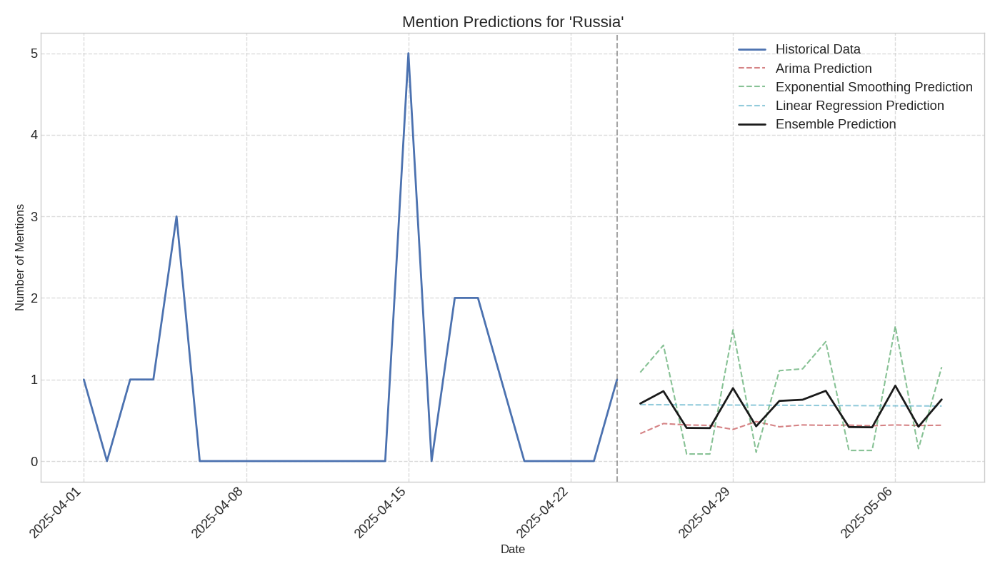

# Prediction Report for 'Russia'

## Overview

This report provides predictions for future mentions of 'Russia' in news articles.

- **Historical Data Range**: 2025-04-01 to 2025-04-24
- **Prediction Range**: 2025-04-25 to 2025-05-08

## Prediction Visualization

## Prediction Models

The predictions are generated using multiple models:

1. **ARIMA**: A time series forecasting model that accounts for autocorrelation in the data
2. **Exponential Smoothing**: A forecasting method that gives more weight to recent observations
3. **Linear Regression**: A simple trend-based prediction model
4. **Ensemble**: An average of all model predictions

## Predicted Mention Counts

| Date | ARIMA | Exponential Smoothing | Linear Regression | Ensemble |
|------|-------|------------------------|-------------------|----------|
| 2025-04-25 | 0.34 | 1.09 | 0.69 | 0.71 |
| 2025-04-26 | 0.46 | 1.42 | 0.69 | 0.86 |
| 2025-04-27 | 0.44 | 0.09 | 0.69 | 0.41 |
| 2025-04-28 | 0.44 | 0.09 | 0.69 | 0.40 |
| 2025-04-29 | 0.39 | 1.61 | 0.69 | 0.89 |
| 2025-04-30 | 0.48 | 0.11 | 0.69 | 0.43 |
| 2025-05-01 | 0.42 | 1.11 | 0.68 | 0.74 |
| 2025-05-02 | 0.44 | 1.13 | 0.68 | 0.75 |
| 2025-05-03 | 0.44 | 1.46 | 0.68 | 0.86 |
| 2025-05-04 | 0.44 | 0.13 | 0.68 | 0.42 |
| 2025-05-05 | 0.43 | 0.13 | 0.68 | 0.41 |
| 2025-05-06 | 0.44 | 1.65 | 0.68 | 0.92 |
| 2025-05-07 | 0.44 | 0.15 | 0.68 | 0.42 |
| 2025-05-08 | 0.44 | 1.15 | 0.68 | 0.76 |

## Interpretation

The prediction chart shows the historical mention pattern and the forecasted mentions for the entity.
The ensemble prediction (black line) represents the consensus forecast from all models.

### Key Observations:

- **Stable Trend**: The model predicts relatively stable mentions of 'Russia' in the near future.

### Note on Reliability:

These predictions are based on historical patterns and should be interpreted with caution.
Unexpected events or changes in news coverage can significantly affect actual outcomes.
