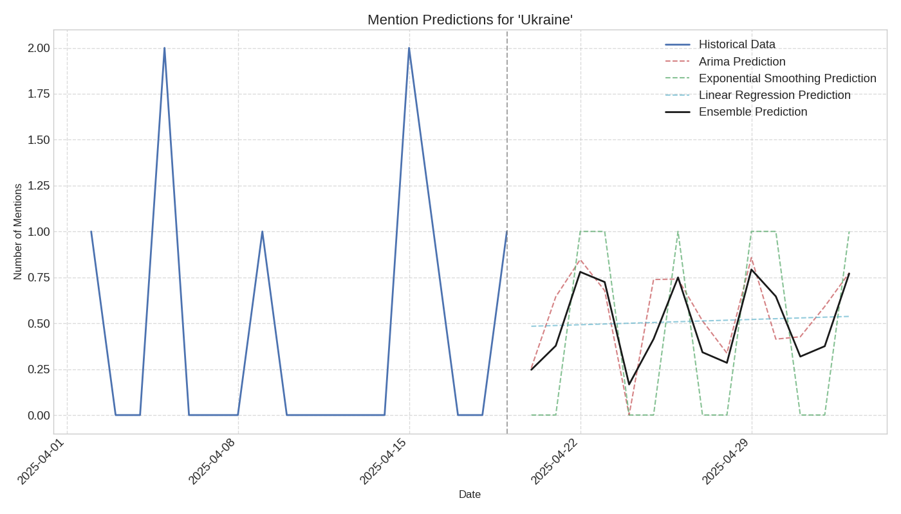

# Prediction Report for 'Ukraine'

## Overview

This report provides predictions for future mentions of 'Ukraine' in news articles.

- **Historical Data Range**: 2025-04-02 to 2025-04-19
- **Prediction Range**: 2025-04-20 to 2025-05-03

## Prediction Visualization

## Prediction Models

The predictions are generated using multiple models:

1. **ARIMA**: A time series forecasting model that accounts for autocorrelation in the data
2. **Exponential Smoothing**: A forecasting method that gives more weight to recent observations
3. **Linear Regression**: A simple trend-based prediction model
4. **Ensemble**: An average of all model predictions

## Predicted Mention Counts

| Date | ARIMA | Exponential Smoothing | Linear Regression | Ensemble |
|------|-------|------------------------|-------------------|----------|
| 2025-04-20 | 0.26 | 0.00 | 0.48 | 0.25 |
| 2025-04-21 | 0.64 | 0.00 | 0.49 | 0.38 |
| 2025-04-22 | 0.85 | 1.00 | 0.49 | 0.78 |
| 2025-04-23 | 0.68 | 1.00 | 0.50 | 0.72 |
| 2025-04-24 | 0.00 | 0.00 | 0.50 | 0.17 |
| 2025-04-25 | 0.74 | 0.00 | 0.50 | 0.41 |
| 2025-04-26 | 0.74 | 1.00 | 0.51 | 0.75 |
| 2025-04-27 | 0.51 | 0.00 | 0.51 | 0.34 |
| 2025-04-28 | 0.34 | 0.00 | 0.52 | 0.28 |
| 2025-04-29 | 0.86 | 1.00 | 0.52 | 0.79 |
| 2025-04-30 | 0.41 | 1.00 | 0.52 | 0.65 |
| 2025-05-01 | 0.43 | 0.00 | 0.53 | 0.32 |
| 2025-05-02 | 0.59 | 0.00 | 0.53 | 0.38 |
| 2025-05-03 | 0.77 | 1.00 | 0.54 | 0.77 |

## Interpretation

The prediction chart shows the historical mention pattern and the forecasted mentions for the entity.
The ensemble prediction (black line) represents the consensus forecast from all models.

### Key Observations:

- **Stable Trend**: The model predicts relatively stable mentions of 'Ukraine' in the near future.
- **Peak Detection**: A significant peak in mentions is predicted around 2025-04-29.

### Note on Reliability:

These predictions are based on historical patterns and should be interpreted with caution.
Unexpected events or changes in news coverage can significantly affect actual outcomes.
