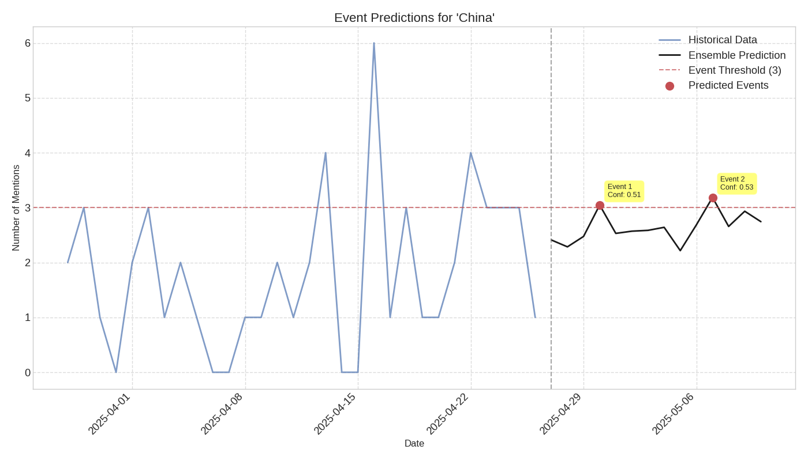

# Event Prediction Report for 'China'

## Overview

This report provides predictions for future events involving 'China' in news articles.

- **Prediction Range**: 2025-04-27 to 2025-05-10
- **Event Threshold**: 3 mentions

## Event Prediction Visualization

## Predicted Events

| Date | Predicted Mentions | Confidence |
|------|-------------------|------------|
| 2025-04-30 | 3.05 | 0.51 |
| 2025-05-07 | 3.18 | 0.53 |

### Event Details

#### Event 1: 2025-04-30

- **Predicted Mentions**: 3.05
- **Confidence**: 0.51
- **Interpretation**: Moderate confidence in this event prediction.

#### Event 2: 2025-05-07

- **Predicted Mentions**: 3.18
- **Confidence**: 0.53
- **Interpretation**: Moderate confidence in this event prediction.

## Interpretation

The event prediction chart shows the historical mention pattern and the forecasted mentions for the entity.
Events are predicted when the forecasted mentions exceed the event threshold and form a local peak.

### Note on Reliability:

Event predictions are based on historical patterns and should be interpreted with caution.
The confidence score indicates the relative certainty of each prediction, but unexpected factors
can significantly affect actual outcomes.
