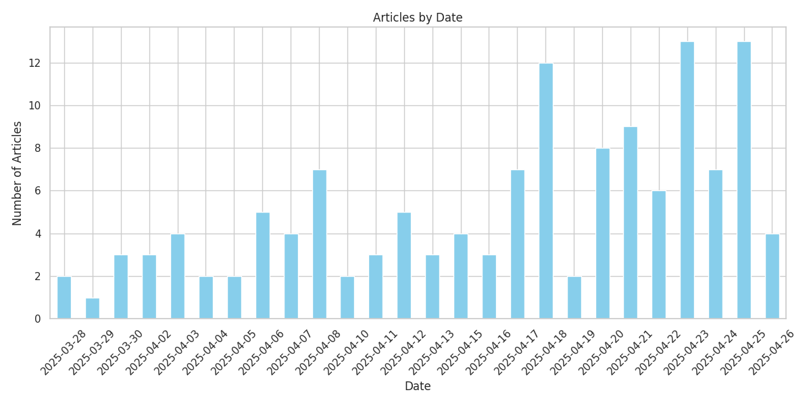
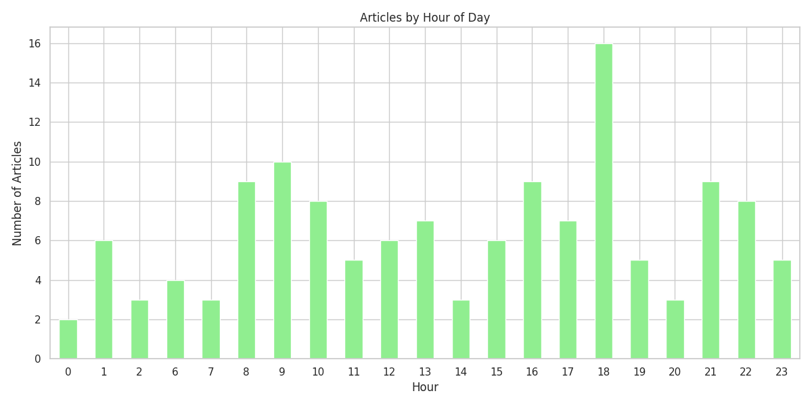
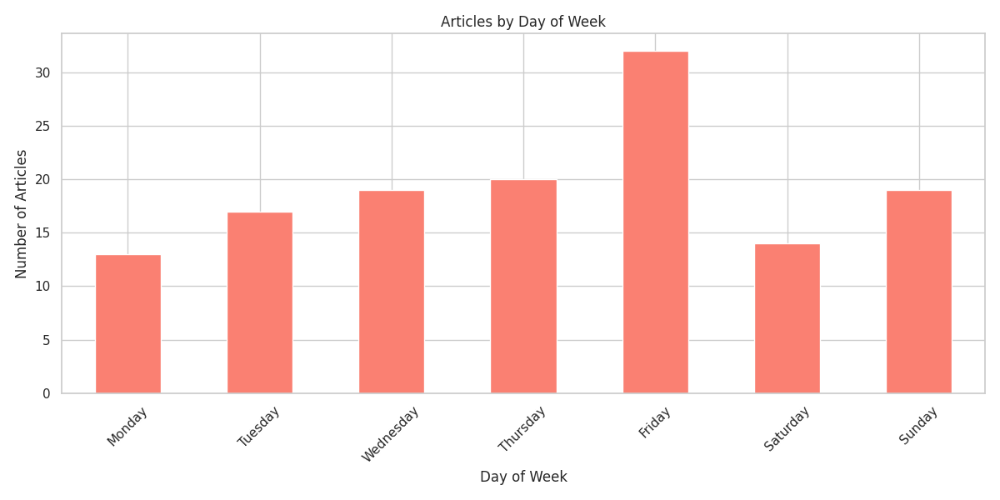
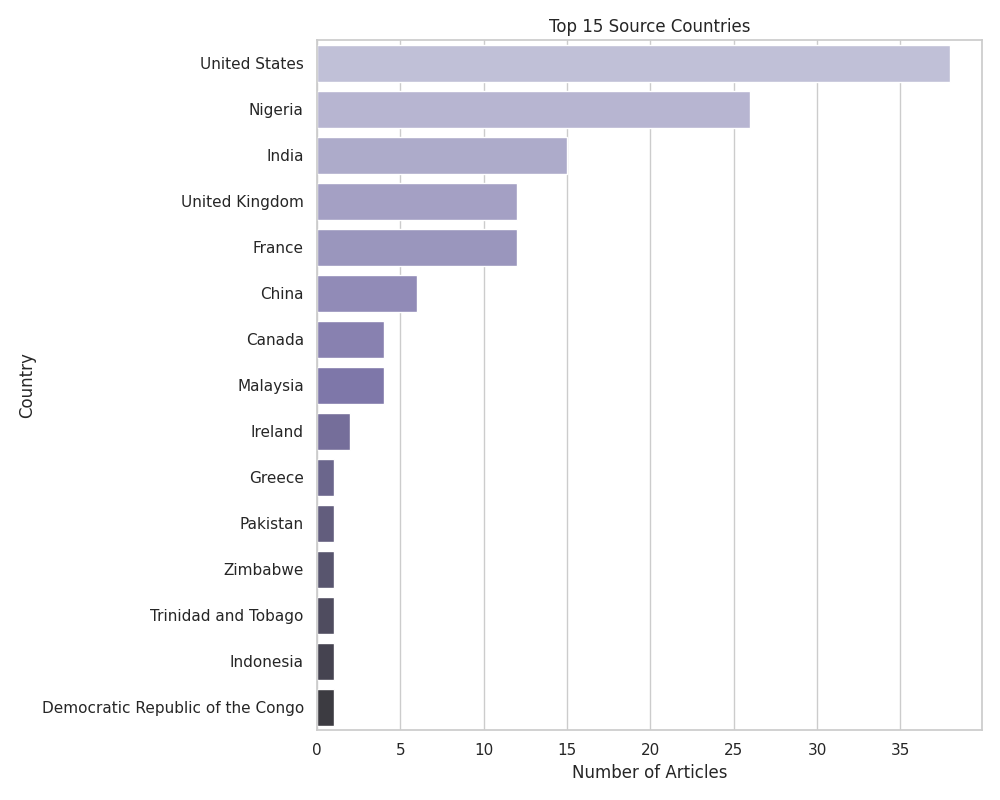

# GDELT News Dataset Analysis (English & French Articles)

## Dataset Summary

- **Total Articles**: 134
- **Total Themes**: 13
- **Languages**: English, French
- **Timespan**: 1 month
- **Filter Date**: 2025-04-26 22:11:15

## Theme Distribution

The dataset contains articles from 13 different themes. The top 10 themes are:

| Theme | Description | Count |
|-------|-------------|-------|
| SECURITY_SERVICES | Security and law enforcement services | 47 |
| GENERAL_HEALTH | Health-related themes | 22 |
| LEGISLATION | Legislative and legal themes | 15 |
| ARREST | Arrests and detentions | 12 |
| GENERAL_GOVERNMENT | Government-related themes | 11 |
| TRIAL | Legal trials and court proceedings | 9 |
| AFFECT | Emotional affect and sentiment | 4 |
| MEDIA_SOCIAL | Social media references | 4 |
| MEDIA_MSM | Mainstream media references | 4 |
| ELECTION | Election-related themes | 3 |

## Temporal Analysis

### Articles by Date

The distribution of articles over the date range:

### Articles by Hour of Day

The distribution of articles by hour of the day:

### Articles by Day of Week

The distribution of articles by day of the week:

## Source Analysis

### Top Domains

The top 10 domains by article count:

| Domain | Count |
|--------|-------|
| nairaland.com | 18 |
| yahoo.com | 13 |
| alwihdainfo.com | 6 |
| thestar.com.my | 4 |
| pennlive.com | 4 |
| fr.allafrica.com | 3 |
| timesofindia.indiatimes.com | 3 |
| thehindu.com | 3 |
| openpr.com | 2 |
| marketscreener.com | 2 |

### Top TLDs

The top 5 top-level domains:

| TLD | Count |
|-----|-------|
| com | 97 |
| uk | 11 |
| fr | 8 |
| my | 4 |
| org | 3 |

### Language Distribution

The distribution of articles by language:

| Language | Count |
|----------|-------|
| English | 110 |
| French | 24 |

### Country Distribution

The distribution of articles by source country:

## Conclusion

This analysis provides an overview of the English and French news articles collected from GDELT over a 1-month period. The dataset covers a wide range of themes and sources, providing a comprehensive view of recent news coverage in these languages.

The dataset is well-suited for:

1. **Training NLP Models**: The articles can be used to train and improve natural language processing models for news analysis.
2. **Cross-lingual Analysis**: The inclusion of both English and French articles enables cross-lingual studies and comparisons.
3. **Theme Classification**: The diverse set of themes allows for training theme classification models.
4. **Source Analysis**: The dataset provides insights into which sources cover which themes.
5. **Temporal Analysis**: The dataset captures temporal patterns in news coverage.

