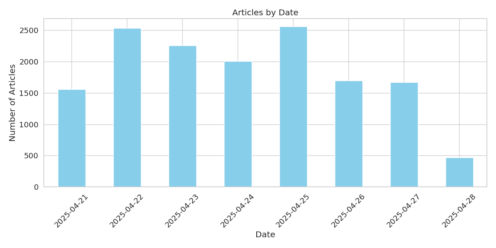
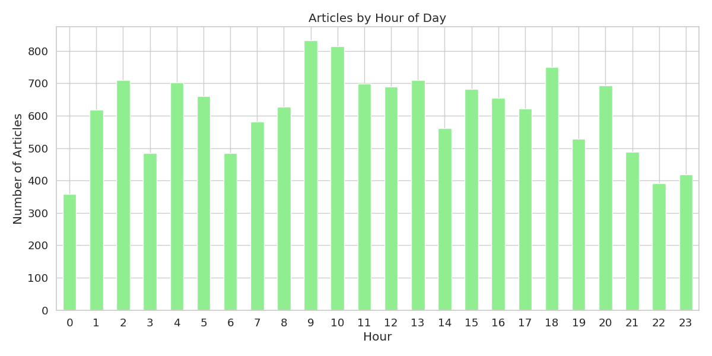
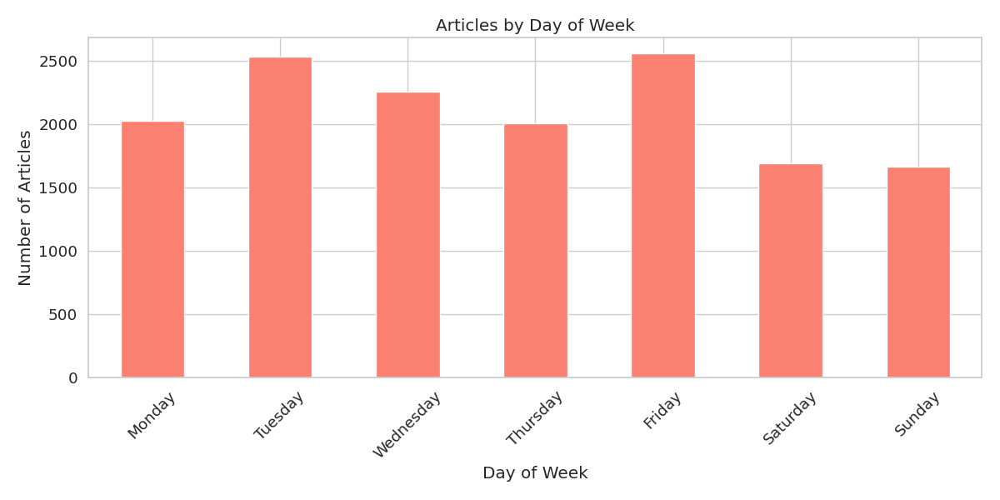
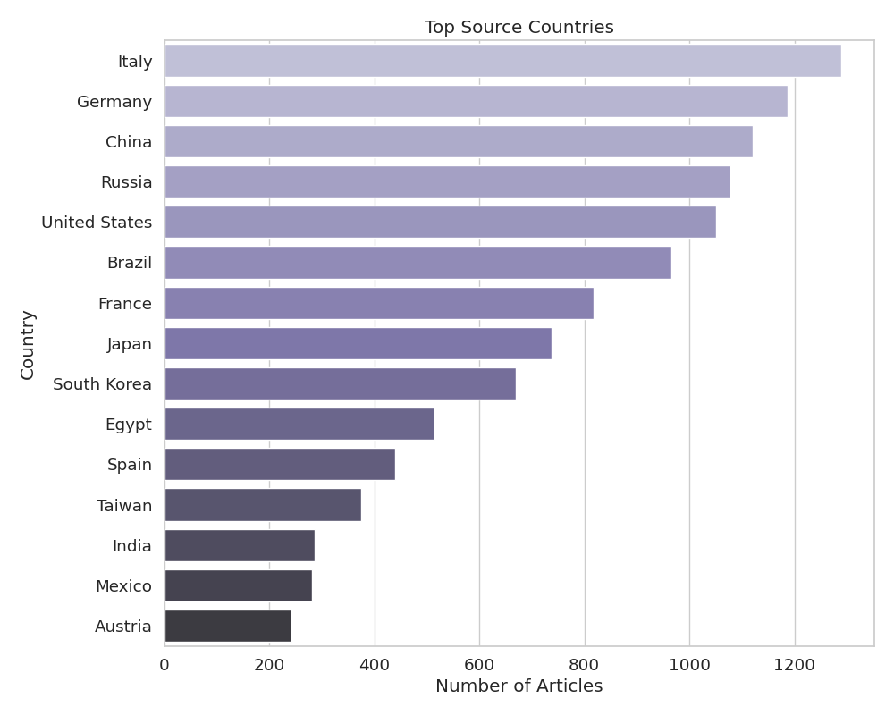
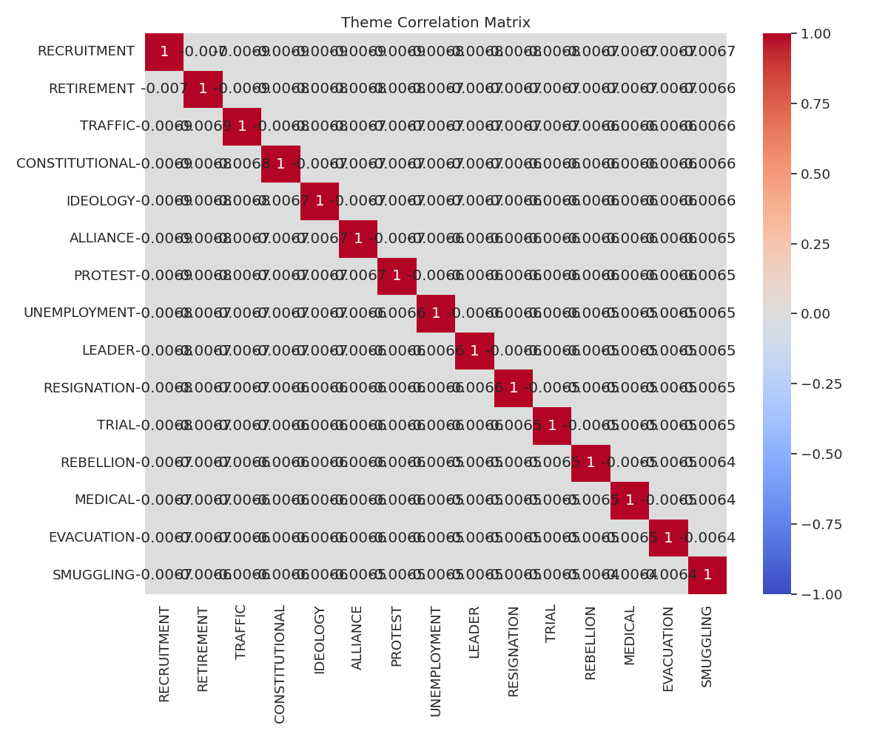
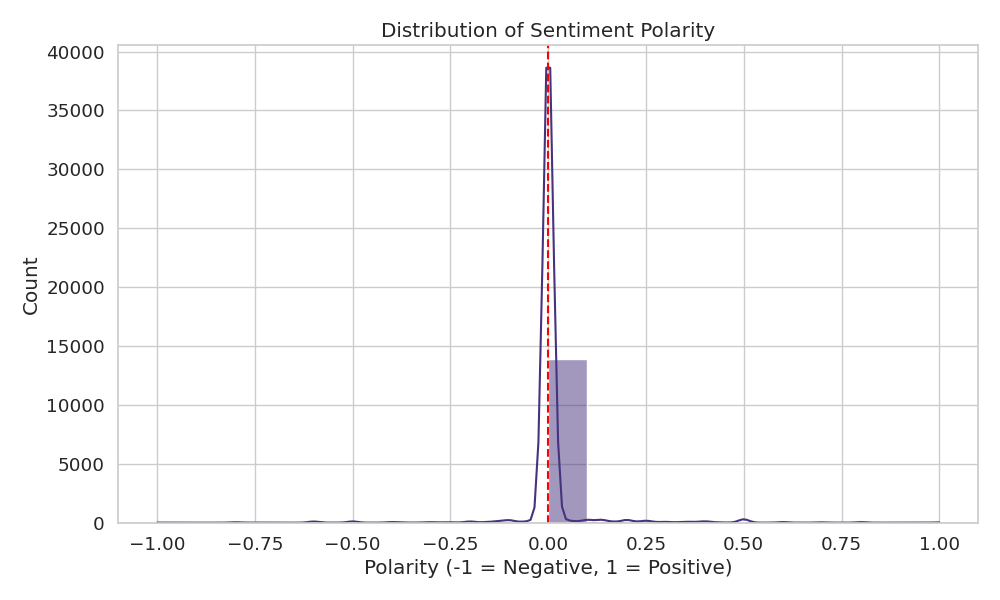
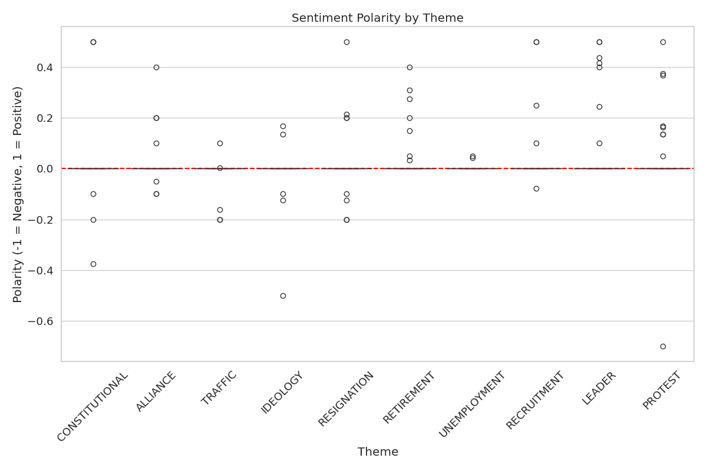

# GDELT News Dataset Analysis (7d)

## Dataset Summary

- **Total Articles**: 14766
- **Total Themes**: 111
- **Date Range**: Unknown to Unknown (7d)
- **Languages**: English, Spanish, German, Russian, Chinese
- **Dataset Size**: 0.14 GB (estimated)
- **Fetch Date**: 2025-04-28 06:45:54

## Theme Distribution

The dataset contains articles from 111 different themes. The top 10 themes are:

| Theme | Description | Count |
|-------|-------------|-------|
| RECRUITMENT | Recruitment and hiring | 103 |
| RETIREMENT | Retirement and pension themes | 101 |
| TRAFFIC | Traffic and transportation flow | 100 |
| CONSTITUTIONAL | Constitutional and foundational legal themes | 99 |
| IDEOLOGY | Ideological and political philosophy themes | 99 |
| ALLIANCE | Alliances and partnerships | 98 |
| PROTEST | Protest and demonstration themes | 98 |
| UNEMPLOYMENT | Unemployment and joblessness | 97 |
| LEADER | References to leadership figures | 97 |
| RESIGNATION | Resignations from positions | 96 |

## Temporal Analysis

### Articles by Date

The distribution of articles over the date range:

### Articles by Hour of Day

The distribution of articles by hour of the day:

### Articles by Day of Week

The distribution of articles by day of the week:

## Source Analysis

### Top Domains

The top 10 domains by article count:

| Domain | Count |
|--------|-------|
| dostor.org | 231 |
| biz.heraldcorp.com | 184 |
| ansa.it | 153 |
| vetogate.com | 138 |
| yahoo.com | 122 |
| g1.globo.com | 115 |
| newspim.com | 108 |
| finance.sina.com.cn | 99 |
| mainichi.jp | 97 |
| zonebourse.com | 94 |

### Top TLDs

The top 5 top-level domains:

| TLD | Count |
|-----|-------|
| com | 5648 |
| de | 1095 |
| it | 1092 |
| ru | 930 |
| br | 732 |

### Language Distribution

The distribution of articles by language:

### Country Distribution

The distribution of articles by source country:

### Source Diversity

The diversity of news sources in the dataset:

| Metric | Value |
|--------|-------|
| Unique Domains | 2505 |
| Unique Countries | 122 |
| Unique Languages | 11 |
| Domain Diversity Index | 0.9978 |
| Country Diversity Index | 0.9523 |
| Language Diversity Index | 0.9049 |

## Theme Relationships

The correlation between the top themes:

## Sentiment Analysis

### Sentiment Distribution

The distribution of sentiment polarity in article titles:

### Sentiment by Theme

The sentiment polarity for the top themes:

### Top Positive and Negative Themes

The themes with the most positive and negative sentiment:

| Theme | Description | Average Sentiment | Article Count |
|-------|-------------|-------------------|---------------|
| INFRASTRUCTURE_BAD_ROADS | Poor road infrastructure | 0.2000 | 1 |
| HEALTH_PANDEMIC | Pandemic and widespread disease themes | 0.1227 | 6 |
| TECH_AUTOMATION | Automation and technological displacement | 0.1121 | 3 |
| DRONES | Drone technology and unmanned vehicles | 0.0900 | 65 |
| DISCRIMINATION_RACE | Racial discrimination | 0.0607 | 7 |

| SOC_INNOVATION | Social innovation and progress | -0.3000 | 1 |
| BORDER | Border and boundary themes | -0.0542 | 80 |
| WATER_SECURITY | Water security and access | -0.0279 | 56 |
| DISPLACED | Displaced persons and forced migration | -0.0240 | 77 |
| ROAD_INCIDENT | Road incidents and accidents | -0.0194 | 27 |

## Topic Modeling

### Discovered Topics

The main topics discovered in the article titles:

**Topic 1**: 國際, nach, gegen, ein, say, day, india, papst, после, pakistan

**Topic 2**: на, 中华网, على, مع, 军事频道, في, области, 生活, من, النيلين

**Topic 3**: der, für, und, im, die, von, 朝日新聞, mit, auf, news

**Topic 4**: da, papa, di, notizie, il, francesco, della, 新闻频道, per, non

**Topic 5**: по, за, на, из, для, новости, россии, не, сша, рф

**Topic 6**: de, le, la, du, et, un, en, pour, une, au

**Topic 7**: de, en, la, el, para, que, del, por, los, con

**Topic 8**: di, في, il, per, 新华网, la, ai, nel, gli, al

**Topic 9**: من, عن, new, في, スポニチ, year, após, health, time, na

**Topic 10**: em, com, de, في, مصر, اليوم, da, غزة, إلى, social

## Conclusion

This analysis provides an overview of the multilingual news dataset collected from GDELT. This dataset provides a comprehensive view of recent news coverage across multiple themes and sources in multiple languages.

### Benefits of the Multilingual Dataset

1. **Recent Coverage**: Focuses on the most recent and relevant news articles
2. **API Reliability**: Uses the officially supported timeframe for maximum data quality
3. **Source Diversity**: Captures a wide range of news sources and perspectives
4. **Theme Coverage**: Includes articles across numerous thematic categories
5. **Language Diversity**: Provides content in multiple languages for cross-lingual analysis
6. **Cultural Perspectives**: Offers different cultural viewpoints on the same news events
7. **Training Data**: Provides a substantial multilingual dataset for training machine learning models
8. **Current Events**: Reflects the current news landscape and emerging topics across language barriers

