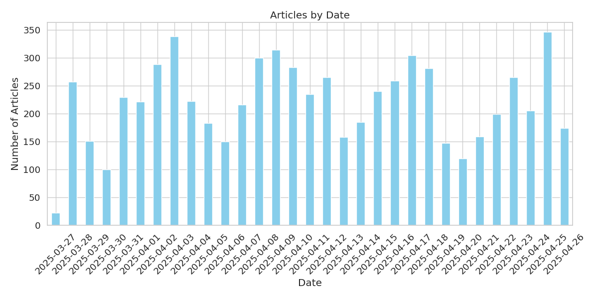
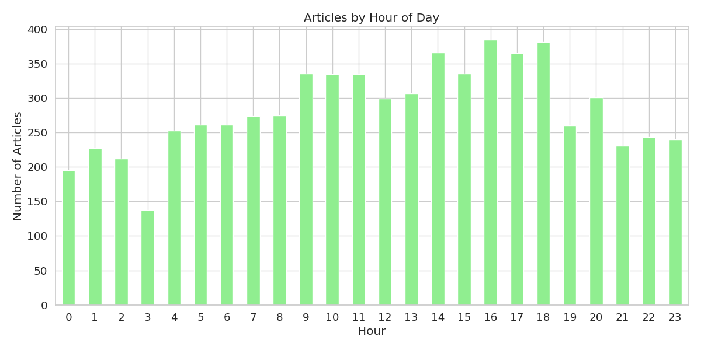
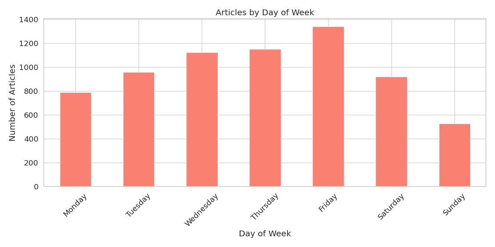
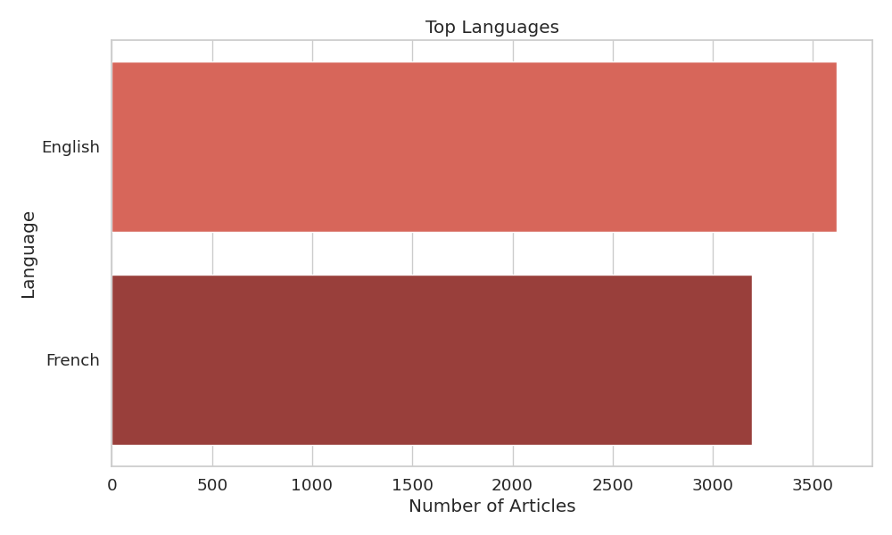
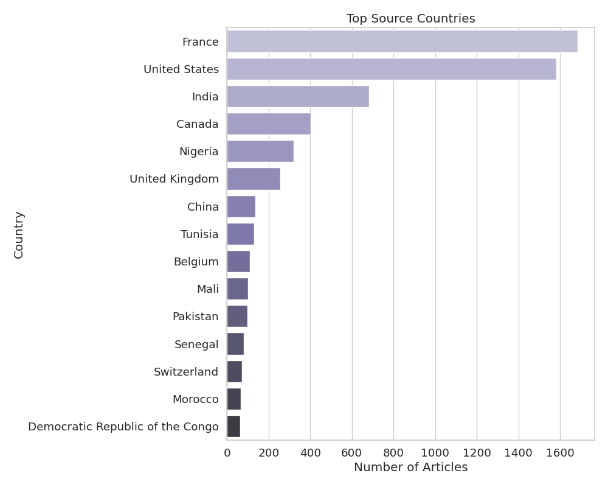
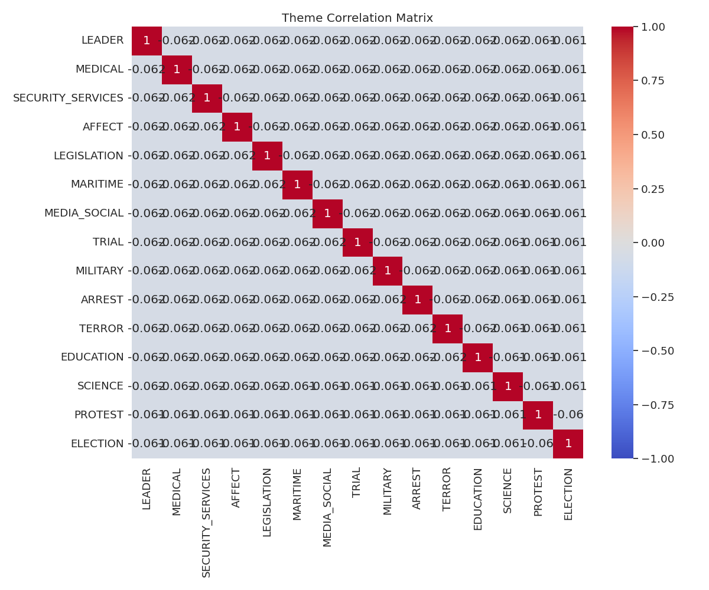

# GDELT News Dataset Analysis (1 month)

## Dataset Summary

- **Total Articles**: 6816
- **Total Themes**: 20
- **Date Range**: 20250327T224500Z to 20250426T223000Z (1 month)
- **Languages**: English, French
- **Dataset Size**: 0.07 GB (estimated)
- **Fetch Date**: 2025-04-26 22:37:03

## Theme Distribution

The dataset contains articles from 20 different themes. The top 10 themes are:

| Theme | Description | Count |
|-------|-------------|-------|
| LEADER | References to leadership figures | 400 |
| MEDICAL | Medical topics and healthcare | 400 |
| SECURITY_SERVICES | Security and law enforcement services | 399 |
| AFFECT | Emotional affect and sentiment | 399 |
| LEGISLATION | Legislative and legal themes | 398 |
| MARITIME | Maritime and naval themes | 397 |
| MEDIA_SOCIAL | Social media references | 397 |
| TRIAL | Legal trials and court proceedings | 397 |
| MILITARY | Military themes and references | 397 |
| ARREST | Arrests and detentions | 396 |

## Temporal Analysis

### Articles by Date

The distribution of articles over the date range:

### Articles by Hour of Day

The distribution of articles by hour of the day:

### Articles by Day of Week

The distribution of articles by day of the week:

## Source Analysis

### Top Domains

The top 10 domains by article count:

| Domain | Count |
|--------|-------|
| yahoo.com | 296 |
| fr.allafrica.com | 171 |
| sudouest.fr | 137 |
| zonebourse.com | 105 |
| timesofindia.indiatimes.com | 78 |
| lemonde.fr | 66 |
| thehindu.com | 62 |
| bfmtv.com | 58 |
| journaldemontreal.com | 58 |
| aninews.in | 55 |

### Top TLDs

The top 5 top-level domains:

| TLD | Count |
|-----|-------|
| com | 4022 |
| fr | 1023 |
| net | 287 |
| uk | 213 |
| org | 139 |

### Language Distribution

The distribution of articles by language:

### Country Distribution

The distribution of articles by source country:

### Source Diversity

The diversity of news sources in the dataset:

| Metric | Value |
|--------|-------|
| Unique Domains | 1210 |
| Unique Countries | 99 |
| Unique Languages | 2 |
| Domain Diversity Index | 0.9943 |
| Country Diversity Index | 0.8654 |
| Language Diversity Index | 0.4981 |

## Theme Relationships

The correlation between the top themes:

## Topic Modeling

### Discovered Topics

The main topics discovered in the article titles:

**Topic 1**: maritime, china, cut, funding, déserts, trump, médicaux, research, united, tariff

**Topic 2**: arrest, judge, watch, science, time, best, one, fbi, live, free

**Topic 3**: terror, attack, school, india, police, protest, news, bill, report, medical

**Topic 4**: de, la, le, et, en, du, sur, un, pour, une

**Topic 5**: trump, de, garcia, abrego, law, judge, administration, divoire, côte, return

**Topic 6**: education, leader, election, trump, debate, federal, say, national, protest, canada

**Topic 7**: de, le, la, du, un, pour, en, et, une, au

**Topic 8**: de, le, la, un, en, une, du, pour, et, chef

**Topic 9**: medical, election, trial, student, could, new, county, april, show, city

**Topic 10**: military, rana, tahawwur, health, trump, court, case, trial, fire, war

## Conclusion

This analysis provides an overview of the multilingual news dataset collected from GDELT. This dataset provides a comprehensive view of recent news coverage across multiple themes and sources in multiple languages.

### Benefits of the Multilingual Dataset

1. **Recent Coverage**: Focuses on the most recent and relevant news articles
2. **API Reliability**: Uses the officially supported timeframe for maximum data quality
3. **Source Diversity**: Captures a wide range of news sources and perspectives
4. **Theme Coverage**: Includes articles across numerous thematic categories
5. **Language Diversity**: Provides content in multiple languages for cross-lingual analysis
6. **Cultural Perspectives**: Offers different cultural viewpoints on the same news events
7. **Training Data**: Provides a substantial multilingual dataset for training machine learning models
8. **Current Events**: Reflects the current news landscape and emerging topics across language barriers

