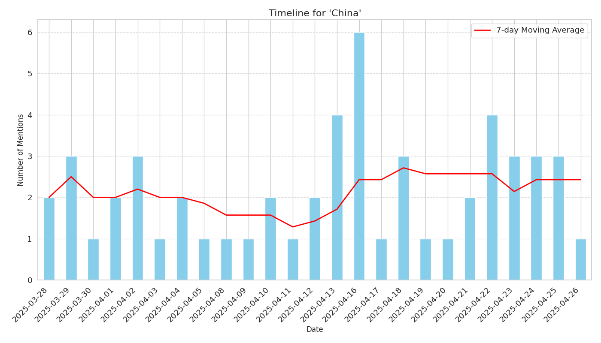

# Timeline Report for 'China'

## Overview

- **Total Mentions**: 54
- **Date Range**: 2025-03-28 to 2025-04-26

## Mention Frequency

## Top Sources

| Source | Mentions |
|--------|----------|
| china.org.cn | 6 |
| yahoo.com | 5 |
| globalsecurity.org | 4 |
| manilatimes.net | 2 |
| economictimes.indiatimes.com | 2 |
| koreaherald.com | 2 |
| politico.eu | 2 |
| finance.yahoo.com | 2 |
| thediplomat.com | 1 |
| theplosblog.plos.org | 1 |

## Top Themes

| Theme | Mentions |
|-------|----------|
| MARITIME | 15 |
| MILITARY | 10 |
| SCIENCE | 9 |
| MEDIA_SOCIAL | 6 |
| SECURITY_SERVICES | 5 |

## Top Articles

| Date | Source | Title | Trust Score |
|------|--------|-------|-------------|
| 2025-03-28 | china.org.cn | [China releases top 10 scientific advances of 2024 - China . org . cn](http://www.china.org.cn/china/2025-03/28/content_117792218.htm) | 0.85 |
| 2025-03-28 | china.org.cn | [China releases top 10 scientific advances of 2024 - China . org . cn](http://www.china.org.cn/china/2025-03/28/content_117792218.htm) | 0.85 |
| 2025-03-29 | china.org.cn | [China sci - fi industry total revenue hits 108 . 96B yuan in 2024](http://www.china.org.cn/arts/2025-03/29/content_117794344.htm) | 0.85 |
| 2025-03-29 | china.org.cn | [China Science Fiction Convention 2025 opens in Beijing with futuristic spectacle](http://www.china.org.cn/arts/2025-03/29/content_117794783.htm) | 0.85 |
| 2025-04-02 | portal.sina.com.hk | [China Science Fiction Convention Concludes with Insightful  Sci - Fi+  Forums Exploring Future Frontiers](https://portal.sina.com.hk/finance/finance-prnewswire/prnasia/2025/04/02/1153543/china-science-fiction-convention-concludes-with-insightful-sci-fi-forums-exploring-future-frontiers/) | 0.85 |
| 2025-04-01 | theplosblog.plos.org | [PLOS announces new partnership in China - The Official PLOS Blog](https://theplosblog.plos.org/2025/04/plos-announces-new-partnership-in-china/) | 0.85 |
| 2025-04-02 | manilatimes.net | [China Science Fiction Convention Concludes with Insightful  Sci - Fi+  Forums Exploring Future Frontiers](https://www.manilatimes.net/2025/04/02/tmt-newswire/pr-newswire/china-science-fiction-convention-concludes-with-insightful-sci-fi-forums-exploring-future-frontiers/2084827) | 0.85 |
| 2025-04-02 | china.org.cn | [China museum to screen international science movies](http://www.china.org.cn/arts/2025-04/02/content_117801241.htm) | 0.85 |
| 2025-04-16 | thehill.com | [Trump decimation of US science and workforce funding is a gift to China](https://thehill.com/opinion/white-house/5250224-trump-attacks-american-science/) | 0.85 |
| 2025-04-08 | china.org.cn | [Tip - off service launched to combat medical insurance fraud - China . org . cn](http://www.china.org.cn/china/2025-04/08/content_117810774.htm) | 0.80 |
| 2025-04-05 | livelaw.in | [Madhya Pradesh HC Issues Notice On Student Plea Who Completed MBBS From China , Against Increase Of Internship Period To Three Years](https://www.livelaw.in/high-court/madhya-pradesh-high-court/madhya-pradesh-high-court-hearing-plea-against-mbbs-students-internship-period-extension-288531) | 0.80 |
| 2025-04-11 | moneycontrol.com | [Indian medical device makers prepare for US push , sensing opportunity from China tariffs](https://www.moneycontrol.com/news/business/companies/indian-medical-device-makers-prepare-for-us-push-sensing-opportunity-from-china-tariffs-12991910.html) | 0.80 |
| 2025-03-30 | 9news.com.au | [Nurses shield newborn babies from tremors in China after Myanmar was rocked by 7 . 7 - magnitude earthquake](https://www.9news.com.au/world/myanmar-earthquake-nurses-in-hospital-in-china-shield-newborns-from-tremors/e23adc90-09cc-491f-9df2-9c332c00916c) | 0.75 |
| 2025-03-29 | thediplomat.com | [  Security Belt 2025  and Beyond : China Minilateralism on the Rise – The Diplomat](https://thediplomat.com/2025/03/security-belt-2025-and-beyond-chinas-minilateralism-on-the-rise/) | 0.75 |
| 2025-04-04 | article.wn.com | [China , US conclude military meeting in Shanghai](https://article.wn.com/view/2025/04/04/China_US_conclude_military_meeting_in_Shanghai/) | 0.75 |
| 2025-04-04 | usa.chinadaily.com.cn | [South China Sea : Imagining the future](http://usa.chinadaily.com.cn/a/202504/04/WS67eefdcda3104d9fd381d94f.html) | 0.75 |
| 2025-04-03 | yahoo.com | [Fitch cuts China credit rating on debt risks amid trade tensions](https://www.yahoo.com/news/fitch-cuts-china-credit-rating-135005733.html) | 0.75 |
| 2025-04-09 | tribune.com.pk | [Zelensky claims China - linked soldiers captured in Donetsk battle](https://tribune.com.pk/story/2538808/zelensky-claims-china-linked-soldiers-captured-in-donetsk-battle) | 0.75 |
| 2025-04-10 | yahoo.com | [Trump sics DOGE on the Navy but ignores China port fees](https://www.yahoo.com/news/trump-sics-doge-navy-ignores-151023507.html) | 0.75 |
| 2025-04-10 | yahoo.com | [UK sends military chief to China for first visit in 10 years](https://www.yahoo.com/news/uk-sends-military-chief-china-184335305.html) | 0.75 |
