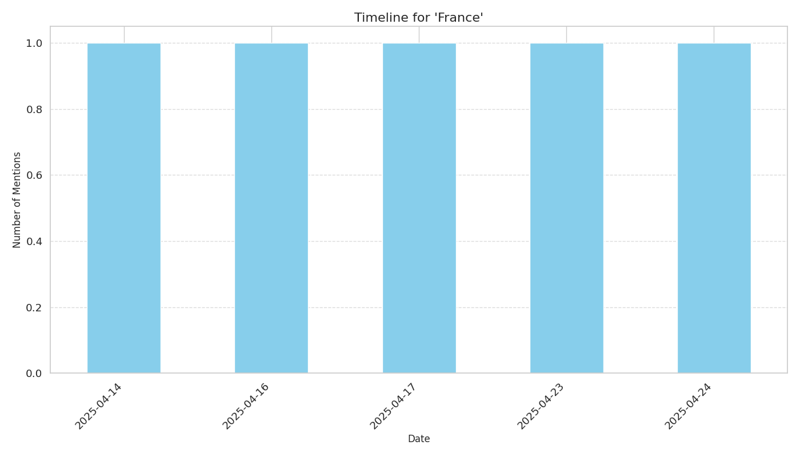

# Timeline Report for 'France'

## Overview

- **Total Mentions**: 5
- **Date Range**: 2025-04-14 to 2025-04-24

## Mention Frequency

## Top Sources

| Source | Mentions |
|--------|----------|
| moroccoworldnews.com | 2 |
| defensenews.com | 1 |
| english.aawsat.com | 1 |
| arabnews.com | 1 |

## Top Themes

| Theme | Mentions |
|-------|----------|
| SECURITY_SERVICES | 3 |
| MILITARY | 1 |
| TRIAL | 1 |

## Top Articles

| Date | Source | Title | Trust Score |
|------|--------|-------|-------------|
| 2025-04-24 | arabnews.com | [France says Tunisian political dissidents did not receive fair trial](https://www.arabnews.com/node/2598285/middle-east) | 0.80 |
| 2025-04-14 | moroccoworldnews.com | [France Calls Morocco a  Precious Partner  in Security Cooperation as Relations Warm France Calls Morocco a  Precious Partner  in Security Cooperation as Relations Warm](https://www.moroccoworldnews.com/2025/04/190316/france-calls-morocco-a-precious-partner-in-security-cooperation-as-relations-warm/) | 0.75 |
| 2025-04-16 | defensenews.com | [Turkey hosts Black Sea security talks with Ukraine , France , united kingdom ](https://www.defensenews.com/global/europe/2025/04/16/turkey-hosts-black-sea-security-talks-with-ukraine-france-uk/) | 0.75 |
| 2025-04-17 | english.aawsat.com | [صحيفة الشرق الأوسط - Algeria Blames French Interior Minister for Renewed Crisis with France](https://english.aawsat.com/arab-world/5133390-algeria-blames-french-interior-minister-renewed-crisis-france) | 0.75 |
| 2025-04-23 | moroccoworldnews.com | [Mohammed V Airport Police Arrest Tunisian Fugitive Wanted by France](https://www.moroccoworldnews.com/2025/04/193160/mohammed-v-airport-police-arrest-tunisian-fugitive-wanted-by-france/) | 0.75 |
